# Scholarly Report on Univariate Time Series Analysis
## Executive Summary
This report presents a statistical analysis of incident frequency over time, aimed at identifying significant deviations from historical norms (anomalies) and detecting emerging patterns (trends). The dataset was disaggregated into distinct time series based on the categorical variables `DISTRICT` and `OFFENSE_DESCRIPTION`. Each resulting time series was modeled and evaluated independently as a separate experiment. This approach is designed to be a comprehensive screening tool, flagging every potential signal for review without applying statistical corrections for multiple comparisons. A noise reduction filter was applied to exclude statistically significant but operationally minor events, such as a single incident occurring in a category that averages less than one event per week. The findings detailed herein represent all events and trends that met the significance threshold, providing a broad set of items for further investigation.
---
## 1. Methodology
The analytical approach comprises several sequential steps: data preparation, model selection, and independent significance testing.

### 1.1. Data Preparation and Aggregation
The raw incident data was first partitioned into subgroups based on unique combinations of the `DISTRICT` and `OFFENSE_DESCRIPTION` fields. For each subgroup, a time series was constructed by resampling the data into weekly incident counts. A minimum of eight weeks of data was required for a subgroup to be included in the analysis.

### 1.2. Probabilistic Model Selection
For each time series, a choice was made between the Poisson and Negative Binomial (NB) distributions to model the historical weekly counts. The model selection was based on an empirical test for overdispersion: if the variance of the historical weekly counts was greater than the mean, the more flexible Negative Binomial distribution was chosen. Otherwise, the Poisson model was used.

### 1.3. Anomaly and Trend Detection
Anomalies were identified by calculating an **anomaly p-value** for each of the last four weeks against the fitted historical model. To quantify the magnitude of each anomaly, a **z-score** was also computed. Trends were assessed by fitting a simple linear regression model to the last four weeks of data, yielding a **trend p-value**.

### 1.4. Significance Testing
Each time series for each subgroup is treated as an independent hypothesis test. This analysis intentionally avoids corrections for multiple comparisons (e.g., Bonferroni, FDR) to maximize sensitivity and ensure all potentially significant events are surfaced for review. The goal is to provide a comprehensive screen rather than a confirmatory analysis.
A conventional significance level (alpha) of **0.05** is used. A finding is reported as statistically significant if its p-value is less than this threshold.

### 1.5. Noise Reduction
For time series with very low frequency (a historical average of less than one event per week), a single event can be flagged as a statistically significant anomaly. To improve the signal-to-noise ratio of the results, such findings are filtered out. An anomaly is only reported if the observed count is greater than 1, or if the historical average is 1 or greater.

---
## 2. Analysis by Group

### 2.1 Overall Data Overview
The following plot shows the raw incident timestamps and weekly aggregated counts for the entire dataset. This provides a high-level context for the detailed findings below.

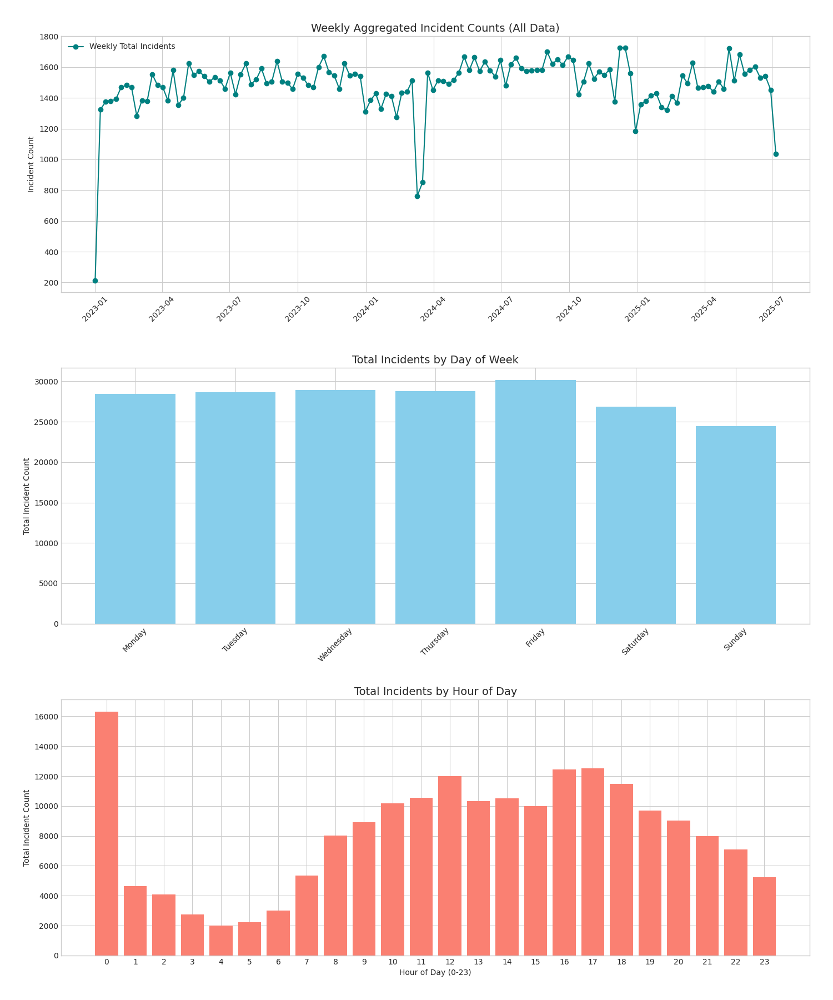

### 2.2 Summary of Significant Findings
| DISTRICT | OFFENSE_DESCRIPTION | Finding Type | Date | P-Value |
|---|---|---|---|---|
| B2 | M/V ACCIDENT - INVOLVING PEDESTRIAN - NO INJURY | Trend | Last 4 Weeks | 0 |
| B2 | SEARCH WARRANT | Trend | Last 4 Weeks | 0 |
| A1 | VANDALISM | Trend | Last 4 Weeks | 1e-20 |
| D14 | LARCENY SHOPLIFTING | Trend | Last 4 Weeks | 1e-20 |
| E13 | THREATS TO DO BODILY HARM | Trend | Last 4 Weeks | 1e-20 |
| E18 | AUTO THEFT - MOTORCYCLE / SCOOTER | Anomaly | 2025-06-29 | 5.758e-06 |
| D4 | TRESPASSING | Anomaly | 2025-06-15 | 7.405e-05 |
| B2 | MISSING PERSON | Anomaly | 2025-06-22 | 0.0001124 |
| E13 | ANIMAL ABUSE | Anomaly | 2025-06-29 | 0.001371 |
| E13 | ANIMAL INCIDENTS (DOG BITES, LOST DOG, ETC) | Anomaly | 2025-06-29 | 0.002066 |
| D14 | SICK/INJURED/MEDICAL - POLICE | Anomaly | 2025-06-15 | 0.002576 |
| C11 | DEATH INVESTIGATION | Anomaly | 2025-06-22 | 0.002688 |
| E13 | VAL - VIOLATION OF AUTO LAW | Anomaly | 2025-06-08 | 0.003091 |
| D4 | LARCENY THEFT FROM MV - NON-ACCESSORY | Anomaly | 2025-06-22 | 0.003142 |
| B3 | ANIMAL INCIDENTS (DOG BITES, LOST DOG, ETC) | Anomaly | 2025-06-22 | 0.005067 |
| D4 | INVESTIGATE PROPERTY | Anomaly | 2025-06-08 | 0.005567 |
| A1 | THREATS TO DO BODILY HARM | Trend | Last 4 Weeks | 0.007722 |
| E18 | SICK/INJURED/MEDICAL - PERSON | Trend | Last 4 Weeks | 0.007722 |
| B3 | BALLISTICS EVIDENCE/FOUND | Anomaly | 2025-06-15 | 0.00779 |
| D14 | M/V PLATES - LOST | Anomaly | 2025-06-29 | 0.008136 |
| D4 | DRUGS - POSSESSION/ SALE/ MANUFACTURING/ USE | Anomaly | 2025-06-22 | 0.008396 |
| A15 | LARCENY THEFT OF MV PARTS & ACCESSORIES | Anomaly | 2025-06-22 | 0.008458 |
| C11 | WARRANT ARREST - OUTSIDE OF BOSTON WARRANT | Anomaly | 2025-06-29 | 0.008483 |
| B3 | VAL - VIOLATION OF AUTO LAW | Anomaly | 2025-06-08 | 0.008719 |
| A7 | INVESTIGATE PROPERTY | Anomaly | 2025-06-08 | 0.009012 |
| A7 | M/V ACCIDENT - INVOLVING PEDESTRIAN - NO INJURY | Anomaly | 2025-06-15 | 0.009718 |
| C11 | INVESTIGATE PERSON | Anomaly | 2025-06-15 | 0.009896 |
| B2 | M/V ACCIDENT - INVOLVING PEDESTRIAN - NO INJURY | Anomaly | 2025-06-15 | 0.01006 |
| D14 | M/V ACCIDENT - INVOLVING BICYCLE - INJURY | Anomaly | 2025-06-08 | 0.01015 |
| D4 | WARRANT ARREST - OUTSIDE OF BOSTON WARRANT | Anomaly | 2025-06-08 | 0.0102 |
| D4 | WARRANT ARREST - OUTSIDE OF BOSTON WARRANT | Anomaly | 2025-06-15 | 0.0102 |
| D14 | LARCENY THEFT FROM BUILDING | Trend | Last 4 Weeks | 0.01022 |
| C11 | LARCENY THEFT OF BICYCLE | Anomaly | 2025-06-08 | 0.01024 |
| C6 | LARCENY THEFT FROM BUILDING | Anomaly | 2025-06-08 | 0.01049 |
| C6 | SEARCH WARRANT | Anomaly | 2025-06-08 | 0.01153 |
| A1 | WARRANT ARREST - OUTSIDE OF BOSTON WARRANT | Anomaly | 2025-06-08 | 0.01193 |
| D14 | SICK/INJURED/MEDICAL - PERSON | Anomaly | 2025-06-15 | 0.01208 |
| D14 | PROPERTY - LOST/ MISSING | Anomaly | 2025-06-08 | 0.0129 |
| B2 | LARCENY SHOPLIFTING | Anomaly | 2025-06-08 | 0.01392 |
| D4 | DRUGS - POSSESSION/ SALE/ MANUFACTURING/ USE | Anomaly | 2025-06-08 | 0.01514 |
| D4 | DRUGS - POSSESSION/ SALE/ MANUFACTURING/ USE | Anomaly | 2025-06-15 | 0.01514 |
| A1 | LARCENY THEFT FROM BUILDING | Trend | Last 4 Weeks | 0.0155 |
| A7 | M/V PLATES - LOST | Anomaly | 2025-06-29 | 0.01599 |
| C11 | M/V ACCIDENT - POLICE VEHICLE | Anomaly | 2025-06-08 | 0.0166 |
| B2 | LARCENY ALL OTHERS | Anomaly | 2025-06-15 | 0.01707 |
| E5 | INVESTIGATE PERSON | Anomaly | 2025-06-22 | 0.01803 |
| A7 | SICK ASSIST | Trend | Last 4 Weeks | 0.01884 |
| C6 | PROPERTY - LOST/ MISSING | Trend | Last 4 Weeks | 0.01884 |
| D14 | M/V - LEAVING SCENE - PROPERTY DAMAGE | Trend | Last 4 Weeks | 0.01884 |
| C11 | TOWED MOTOR VEHICLE | Anomaly | 2025-06-08 | 0.01968 |
| E13 | INVESTIGATE PERSON | Anomaly | 2025-06-22 | 0.01987 |
| C11 | M/V ACCIDENT - INVOLVING BICYCLE - INJURY | Anomaly | 2025-06-08 | 0.01998 |
| C11 | VANDALISM | Anomaly | 2025-06-15 | 0.02018 |
| A1 | TOWED MOTOR VEHICLE | Anomaly | 2025-06-08 | 0.02094 |
| C11 | SICK ASSIST | Anomaly | 2025-06-15 | 0.0212 |
| E13 | SUDDEN DEATH | Anomaly | 2025-06-29 | 0.02139 |
| A7 | VERBAL DISPUTE | Anomaly | 2025-06-15 | 0.02144 |
| A7 | INVESTIGATE PROPERTY | Anomaly | 2025-06-15 | 0.02166 |
| E5 | VAL - VIOLATION OF AUTO LAW | Anomaly | 2025-06-22 | 0.02214 |
| B3 | VIOLATION - CITY ORDINANCE | Anomaly | 2025-06-08 | 0.0227 |
| E18 | DRUGS - POSSESSION/ SALE/ MANUFACTURING/ USE | Anomaly | 2025-06-22 | 0.02334 |
| D4 | ASSAULT - SIMPLE | Anomaly | 2025-06-29 | 0.02452 |
| B3 | RECOVERED - MV RECOVERED IN BOSTON (STOLEN OUTSIDE BOSTON) | Anomaly | 2025-06-08 | 0.02473 |
| C11 | INVESTIGATE PERSON | Anomaly | 2025-06-22 | 0.02514 |
| A7 | SICK ASSIST | Anomaly | 2025-06-08 | 0.02517 |
| A1 | DEATH INVESTIGATION | Anomaly | 2025-06-22 | 0.02544 |
| C11 | LARCENY ALL OTHERS | Anomaly | 2025-06-22 | 0.02618 |
| B3 | FIRE REPORT | Anomaly | 2025-06-29 | 0.02638 |
| B2 | MISSING PERSON - LOCATED | Anomaly | 2025-06-08 | 0.02638 |
| B3 | M/V ACCIDENT - PERSONAL INJURY | Anomaly | 2025-06-22 | 0.02645 |
| E18 | MISSING PERSON - NOT REPORTED - LOCATED | Anomaly | 2025-06-08 | 0.0265 |
| E18 | MISSING PERSON - NOT REPORTED - LOCATED | Anomaly | 2025-06-22 | 0.0265 |
| D14 | INVESTIGATE PROPERTY | Anomaly | 2025-06-15 | 0.02688 |
| E18 | SICK/INJURED/MEDICAL - PERSON | Anomaly | 2025-06-08 | 0.02717 |
| D4 | SERVICE TO OTHER AGENCY | Anomaly | 2025-06-08 | 0.02728 |
| E13 | DEATH INVESTIGATION | Anomaly | 2025-06-08 | 0.02783 |
| B2 | LARCENY THEFT OF BICYCLE | Anomaly | 2025-06-22 | 0.02833 |
| D14 | VANDALISM | Anomaly | 2025-06-22 | 0.02845 |
| B2 | WARRANT ARREST - BOSTON WARRANT (MUST BE SUPPLEMENTAL) | Anomaly | 2025-06-15 | 0.02908 |
| D4 | WARRANT ARREST - OUTSIDE OF BOSTON WARRANT | Anomaly | 2025-06-22 | 0.02959 |
| A1 | INVESTIGATE PERSON | Anomaly | 2025-06-08 | 0.03042 |
| B2 | FIREARM/WEAPON - FOUND OR CONFISCATED | Anomaly | 2025-06-15 | 0.03083 |
| B2 | ASSAULT - AGGRAVATED | Anomaly | 2025-06-08 | 0.03176 |
| D14 | M/V ACCIDENT - OTHER CITY VEHICLE | Anomaly | 2025-06-08 | 0.03312 |
| C6 | BALLISTICS EVIDENCE/FOUND | Anomaly | 2025-06-29 | 0.03331 |
| C11 | MISSING PERSON | Anomaly | 2025-06-29 | 0.03416 |
| C6 | AUTO THEFT - MOTORCYCLE / SCOOTER | Anomaly | 2025-06-22 | 0.03419 |
| D4 | TRESPASSING | Anomaly | 2025-06-22 | 0.03446 |
| A7 | LARCENY THEFT OF BICYCLE | Anomaly | 2025-06-22 | 0.03447 |
| B3 | TOWED MOTOR VEHICLE | Anomaly | 2025-06-15 | 0.03499 |
| A7 | INVESTIGATE PROPERTY | Trend | Last 4 Weeks | 0.03524 |
| B3 | BURGLARY - COMMERICAL | Anomaly | 2025-06-29 | 0.03571 |
| C6 | PROPERTY - LOST/ MISSING | Anomaly | 2025-06-29 | 0.03729 |
| D14 | M/V ACCIDENT - INVOLVING BICYCLE - INJURY | Anomaly | 2025-06-29 | 0.03754 |
| B3 | M/V ACCIDENT - OTHER | Anomaly | 2025-06-15 | 0.038 |
| C11 | AUTO THEFT - MOTORCYCLE / SCOOTER | Anomaly | 2025-06-15 | 0.03872 |
| C11 | AUTO THEFT - MOTORCYCLE / SCOOTER | Anomaly | 2025-06-22 | 0.03872 |
| B2 | MISSING PERSON | Anomaly | 2025-06-29 | 0.03928 |
| A15 | LARCENY THEFT FROM BUILDING | Anomaly | 2025-06-08 | 0.03981 |
| E5 | DEATH INVESTIGATION | Anomaly | 2025-06-08 | 0.03986 |
| A1 | MISSING PERSON - LOCATED | Anomaly | 2025-06-22 | 0.03998 |
| B2 | SEARCH WARRANT | Anomaly | 2025-06-15 | 0.04017 |
| E13 | WARRANT ARREST - OUTSIDE OF BOSTON WARRANT | Anomaly | 2025-06-15 | 0.04081 |
| D4 | INVESTIGATE PROPERTY | Anomaly | 2025-06-29 | 0.04145 |
| E13 | BURGLARY - COMMERICAL | Anomaly | 2025-06-22 | 0.04194 |
| B2 | FRAUD - CREDIT CARD / ATM FRAUD | Anomaly | 2025-06-22 | 0.04211 |
| E13 | M/V - LEAVING SCENE - PROPERTY DAMAGE | Anomaly | 2025-06-29 | 0.04265 |
| B3 | INVESTIGATE PROPERTY | Anomaly | 2025-06-29 | 0.04267 |
| B3 | AUTO THEFT | Anomaly | 2025-06-22 | 0.04277 |
| C6 | M/V - LEAVING SCENE - PROPERTY DAMAGE | Anomaly | 2025-06-15 | 0.04313 |
| B2 | AUTO THEFT - MOTORCYCLE / SCOOTER | Anomaly | 2025-06-08 | 0.04416 |
| D14 | VAL - VIOLATION OF AUTO LAW | Anomaly | 2025-06-15 | 0.04423 |
| B3 | WARRANT ARREST - OUTSIDE OF BOSTON WARRANT | Anomaly | 2025-06-08 | 0.0451 |
| B2 | BALLISTICS EVIDENCE/FOUND | Anomaly | 2025-06-29 | 0.04515 |
| B3 | INVESTIGATE PROPERTY | Trend | Last 4 Weeks | 0.04559 |
| E13 | ASSAULT - AGGRAVATED | Anomaly | 2025-06-22 | 0.04594 |
| C6 | INVESTIGATE PERSON | Anomaly | 2025-06-08 | 0.04665 |
| C6 | INVESTIGATE PERSON | Anomaly | 2025-06-15 | 0.04665 |
| A1 | BURGLARY - COMMERICAL | Anomaly | 2025-06-29 | 0.04684 |
| B3 | AUTO THEFT - MOTORCYCLE / SCOOTER | Anomaly | 2025-06-22 | 0.04696 |
| C6 | ANIMAL INCIDENTS (DOG BITES, LOST DOG, ETC) | Anomaly | 2025-06-15 | 0.0472 |
| E5 | INVESTIGATE PERSON | Anomaly | 2025-06-08 | 0.04741 |

### 2.3 Detailed Analysis of Findings

#### Finding 1: Trend in 'M/V ACCIDENT - INVOLVING PEDESTRIAN - NO INJURY' for B2
- **Description**: Significant Upward Trend
- **Weekly Change (Slope)**: 2.00
- **Significance (p-value)**: 0
- **City-Wide Context**: The trend for 'M/V ACCIDENT - INVOLVING PEDESTRIAN - NO INJURY' across all DISTRICTs is: **Not Significant** (p-value: 0.8915, slope: -0.20).

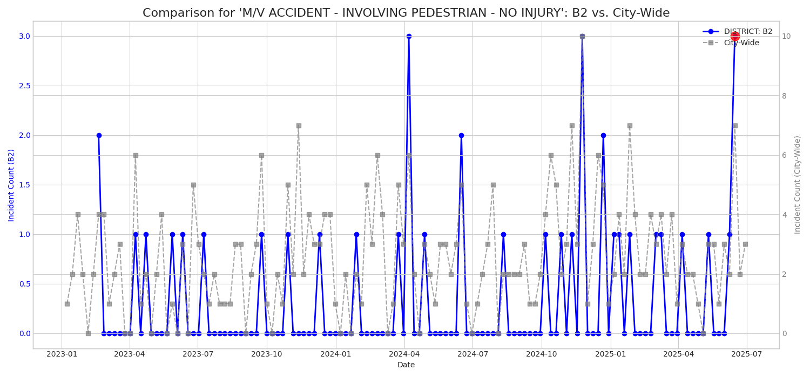

#### Finding 2: Trend in 'SEARCH WARRANT' for B2
- **Description**: Significant Upward Trend
- **Weekly Change (Slope)**: 2.00
- **Significance (p-value)**: 0
- **City-Wide Context**: The trend for 'SEARCH WARRANT' across all DISTRICTs is: **Potential Downward Trend** (p-value: 0.05132, slope: -1.20).

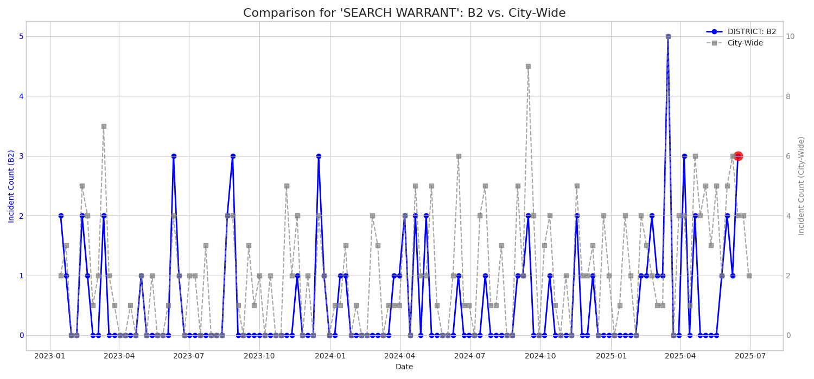

#### Finding 3: Trend in 'VANDALISM' for A1
- **Description**: Significant Downward Trend
- **Weekly Change (Slope)**: -1.00
- **Significance (p-value)**: 1e-20
- **City-Wide Context**: The trend for 'VANDALISM' across all DISTRICTs is: **Not Significant** (p-value: 0.5788, slope: -2.80).

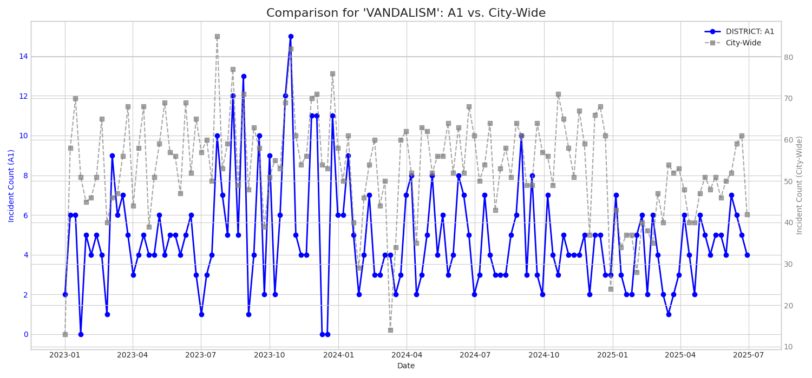

#### Finding 4: Trend in 'LARCENY SHOPLIFTING' for D14
- **Description**: Significant Upward Trend
- **Weekly Change (Slope)**: 1.00
- **Significance (p-value)**: 1e-20
- **City-Wide Context**: The trend for 'LARCENY SHOPLIFTING' across all DISTRICTs is: **Not Significant** (p-value: 0.7438, slope: -1.30).

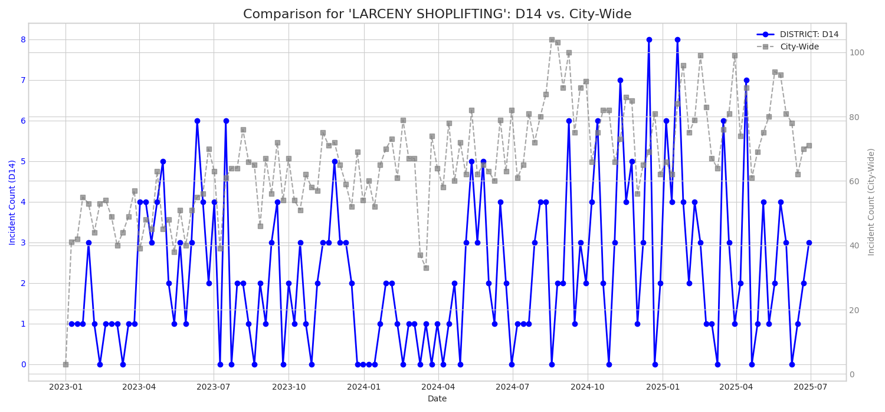

#### Finding 5: Trend in 'THREATS TO DO BODILY HARM' for E13
- **Description**: Significant Downward Trend
- **Weekly Change (Slope)**: -1.00
- **Significance (p-value)**: 1e-20
- **City-Wide Context**: The trend for 'THREATS TO DO BODILY HARM' across all DISTRICTs is: **Not Significant** (p-value: 0.9583, slope: 0.10).

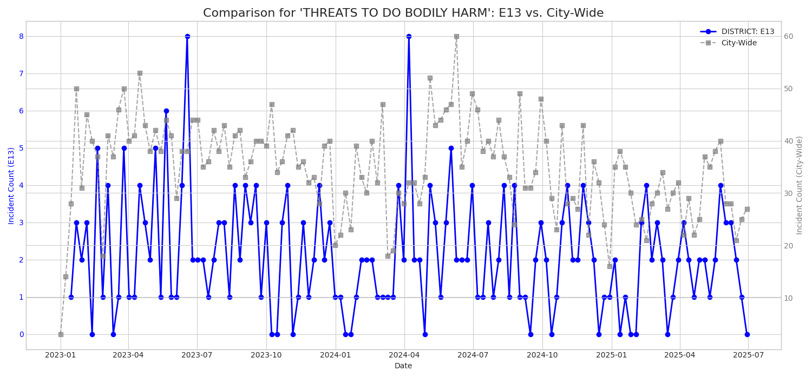

#### Finding 6: Anomaly in 'AUTO THEFT - MOTORCYCLE / SCOOTER' for E18
- **Date**: 2025-06-29
- **Observed Count**: 9 (Historical Avg: 0.25)
- **Magnitude (Z-Score)**: 14.53
- **Significance (p-value)**: 5.758e-06
- **City-Wide Context**: The same week was **not significant** for 'AUTO THEFT - MOTORCYCLE / SCOOTER' across all DISTRICTs (p-value: 0.05141).

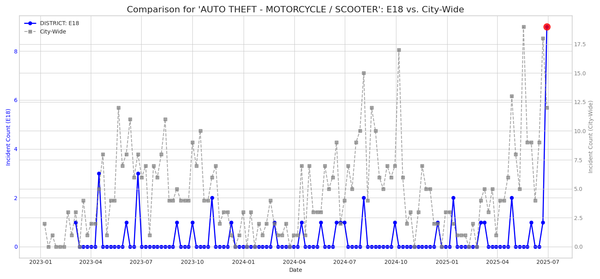

#### Finding 7: Anomaly in 'TRESPASSING' for D4
- **Date**: 2025-06-15
- **Observed Count**: 8 (Historical Avg: 1.15)
- **Magnitude (Z-Score)**: 6.18
- **Significance (p-value)**: 7.405e-05
- **City-Wide Context**: The same week was **not significant** for 'TRESPASSING' across all DISTRICTs (p-value: 0.05881).

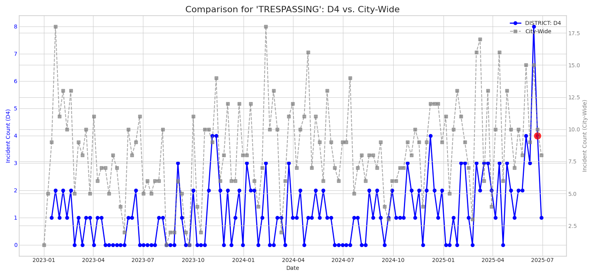

#### Finding 8: Anomaly in 'MISSING PERSON' for B2
- **Date**: 2025-06-22
- **Observed Count**: 6 (Historical Avg: 0.23)
- **Magnitude (Z-Score)**: 10.34
- **Significance (p-value)**: 0.0001124
- **City-Wide Context**: The same week was **significant** for 'MISSING PERSON' across all DISTRICTs (p-value: 0.02484).

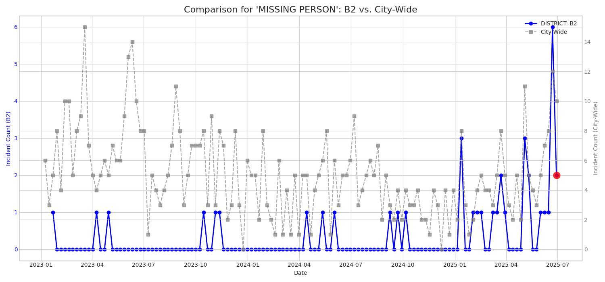

#### Finding 9: Anomaly in 'ANIMAL ABUSE' for E13
- **Date**: 2025-06-29
- **Observed Count**: 3 (Historical Avg: 0.03)
- **Magnitude (Z-Score)**: 13.60
- **Significance (p-value)**: 0.001371
- **City-Wide Context**: The same week was **significant** for 'ANIMAL ABUSE' across all DISTRICTs (p-value: 0.004757).

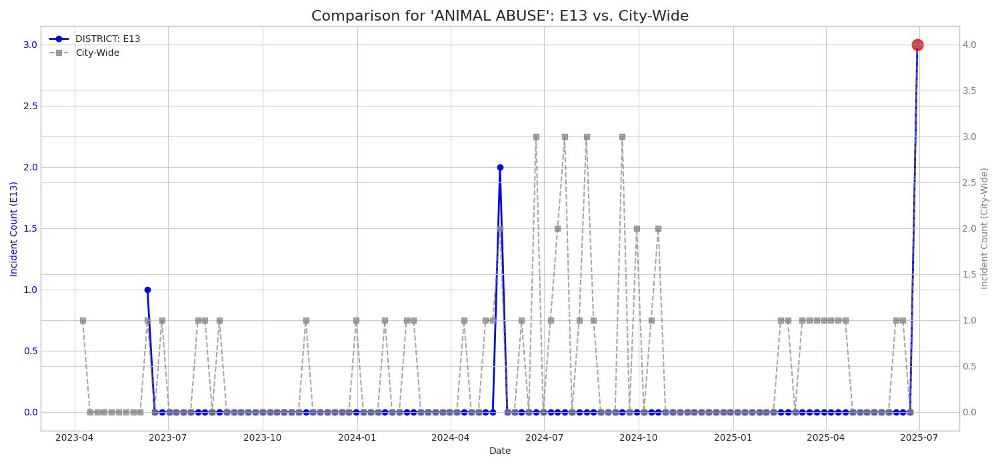

#### Finding 10: Anomaly in 'ANIMAL INCIDENTS (DOG BITES, LOST DOG, ETC)' for E13
- **Date**: 2025-06-29
- **Observed Count**: 3 (Historical Avg: 0.25)
- **Magnitude (Z-Score)**: 5.55
- **Significance (p-value)**: 0.002066
- **City-Wide Context**: The same week was **not significant** for 'ANIMAL INCIDENTS (DOG BITES, LOST DOG, ETC)' across all DISTRICTs (p-value: 0.0781).

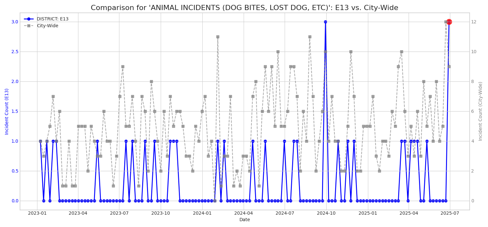

#### Finding 11: Anomaly in 'SICK/INJURED/MEDICAL - POLICE' for D14
- **Date**: 2025-06-15
- **Observed Count**: 3 (Historical Avg: 0.27)
- **Magnitude (Z-Score)**: 5.30
- **Significance (p-value)**: 0.002576
- **City-Wide Context**: The same week was **not significant** for 'SICK/INJURED/MEDICAL - POLICE' across all DISTRICTs (p-value: 0.8048).

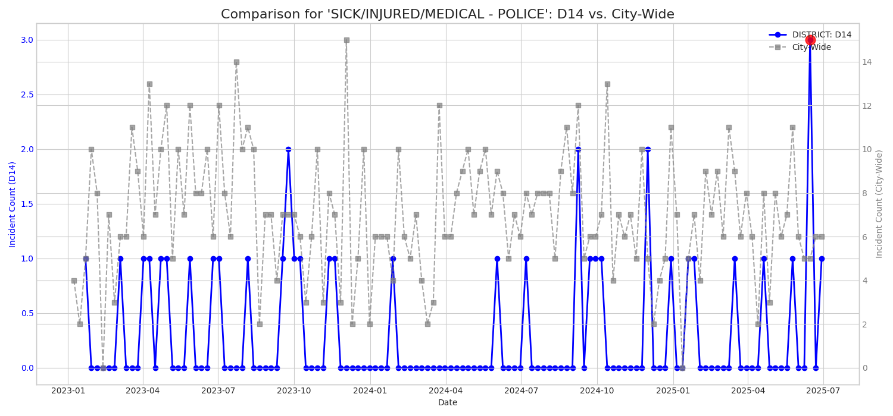

#### Finding 12: Anomaly in 'DEATH INVESTIGATION' for C11
- **Date**: 2025-06-22
- **Observed Count**: 4 (Historical Avg: 0.56)
- **Magnitude (Z-Score)**: 4.58
- **Significance (p-value)**: 0.002688
- **City-Wide Context**: The same week was **not significant** for 'DEATH INVESTIGATION' across all DISTRICTs (p-value: 0.05768).

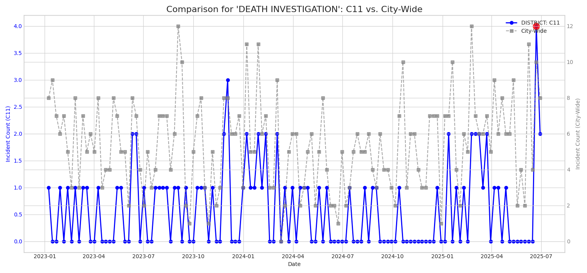

#### Finding 13: Anomaly in 'VAL - VIOLATION OF AUTO LAW' for E13
- **Date**: 2025-06-08
- **Observed Count**: 7 (Historical Avg: 1.27)
- **Magnitude (Z-Score)**: 4.39
- **Significance (p-value)**: 0.003091
- **City-Wide Context**: The same week was **significant** for 'VAL - VIOLATION OF AUTO LAW' across all DISTRICTs (p-value: 0.003587).

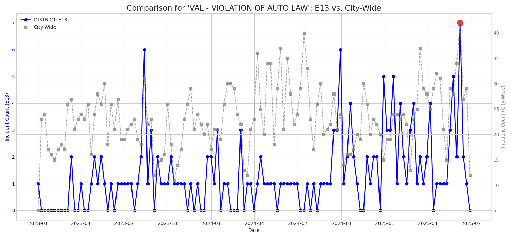

#### Finding 14: Anomaly in 'LARCENY THEFT FROM MV - NON-ACCESSORY' for D4
- **Date**: 2025-06-22
- **Observed Count**: 18 (Historical Avg: 7.71)
- **Magnitude (Z-Score)**: 3.37
- **Significance (p-value)**: 0.003142
- **City-Wide Context**: The same week was **not significant** for 'LARCENY THEFT FROM MV - NON-ACCESSORY' across all DISTRICTs (p-value: 0.2664).

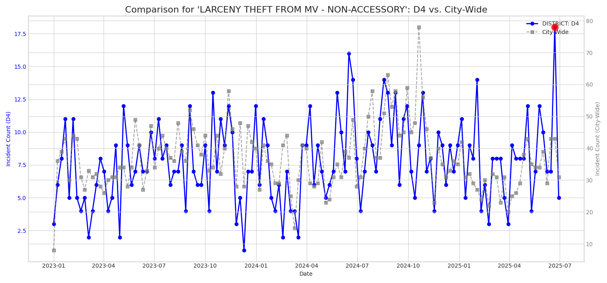

#### Finding 15: Anomaly in 'ANIMAL INCIDENTS (DOG BITES, LOST DOG, ETC)' for B3
- **Date**: 2025-06-22
- **Observed Count**: 4 (Historical Avg: 0.67)
- **Magnitude (Z-Score)**: 4.05
- **Significance (p-value)**: 0.005067
- **City-Wide Context**: The same week was **significant** for 'ANIMAL INCIDENTS (DOG BITES, LOST DOG, ETC)' across all DISTRICTs (p-value: 0.01056).

#### Finding 16: Anomaly in 'INVESTIGATE PROPERTY' for D4
- **Date**: 2025-06-08
- **Observed Count**: 19 (Historical Avg: 7.83)
- **Magnitude (Z-Score)**: 3.20
- **Significance (p-value)**: 0.005567
- **City-Wide Context**: The same week was **not significant** for 'INVESTIGATE PROPERTY' across all DISTRICTs (p-value: 0.3374).

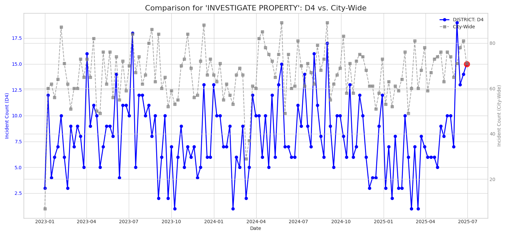

#### Finding 17: Trend in 'THREATS TO DO BODILY HARM' for A1
- **Description**: Significant Upward Trend
- **Weekly Change (Slope)**: 1.60
- **Significance (p-value)**: 0.007722
- **City-Wide Context**: The trend for 'THREATS TO DO BODILY HARM' across all DISTRICTs is: **Not Significant** (p-value: 0.9583, slope: 0.10).

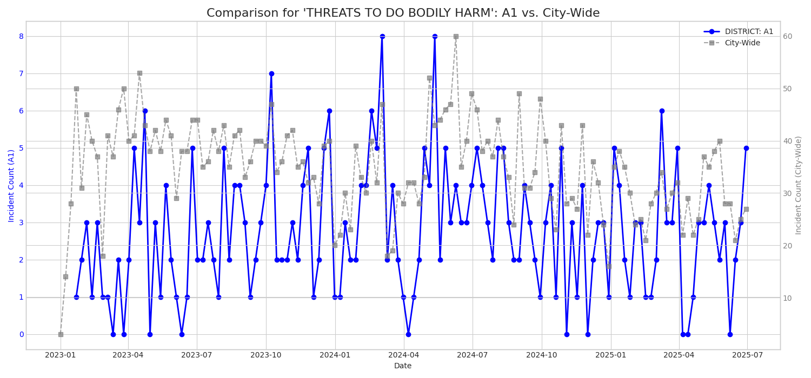

#### Finding 18: Trend in 'SICK/INJURED/MEDICAL - PERSON' for E18
- **Description**: Significant Downward Trend
- **Weekly Change (Slope)**: -1.60
- **Significance (p-value)**: 0.007722
- **City-Wide Context**: The trend for 'SICK/INJURED/MEDICAL - PERSON' across all DISTRICTs is: **Not Significant** (p-value: 0.3112, slope: -2.20).

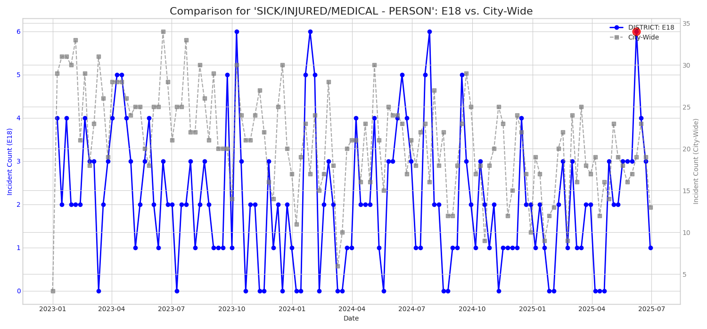

#### Finding 19: Anomaly in 'BALLISTICS EVIDENCE/FOUND' for B3
- **Date**: 2025-06-15
- **Observed Count**: 5 (Historical Avg: 0.69)
- **Magnitude (Z-Score)**: 4.26
- **Significance (p-value)**: 0.00779
- **City-Wide Context**: The same week was **significant** for 'BALLISTICS EVIDENCE/FOUND' across all DISTRICTs (p-value: 0.008338).

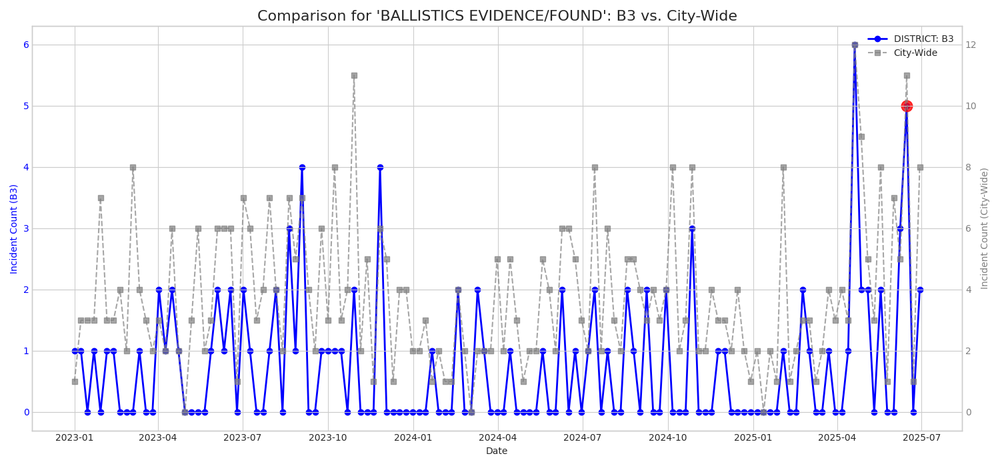

#### Finding 20: Anomaly in 'M/V PLATES - LOST' for D14
- **Date**: 2025-06-29
- **Observed Count**: 2 (Historical Avg: 0.13)
- **Magnitude (Z-Score)**: 5.21
- **Significance (p-value)**: 0.008136
- **City-Wide Context**: The same week was **not significant** for 'M/V PLATES - LOST' across all DISTRICTs (p-value: 0.2991).

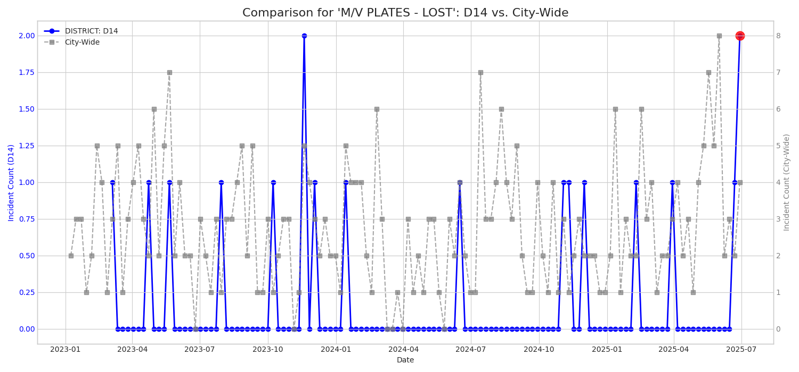

#### Finding 21: Anomaly in 'DRUGS - POSSESSION/ SALE/ MANUFACTURING/ USE' for D4
- **Date**: 2025-06-22
- **Observed Count**: 18 (Historical Avg: 3.92)
- **Magnitude (Z-Score)**: 3.71
- **Significance (p-value)**: 0.008396
- **City-Wide Context**: The same week was **not significant** for 'DRUGS - POSSESSION/ SALE/ MANUFACTURING/ USE' across all DISTRICTs (p-value: 0.1501).

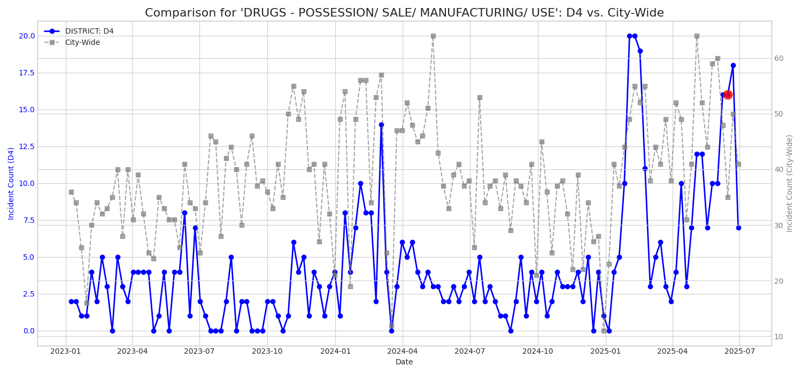

#### Finding 22: Anomaly in 'LARCENY THEFT OF MV PARTS & ACCESSORIES' for A15
- **Date**: 2025-06-22
- **Observed Count**: 2 (Historical Avg: 0.13)
- **Magnitude (Z-Score)**: 5.12
- **Significance (p-value)**: 0.008458
- **City-Wide Context**: The same week was **not significant** for 'LARCENY THEFT OF MV PARTS & ACCESSORIES' across all DISTRICTs (p-value: 0.4301).

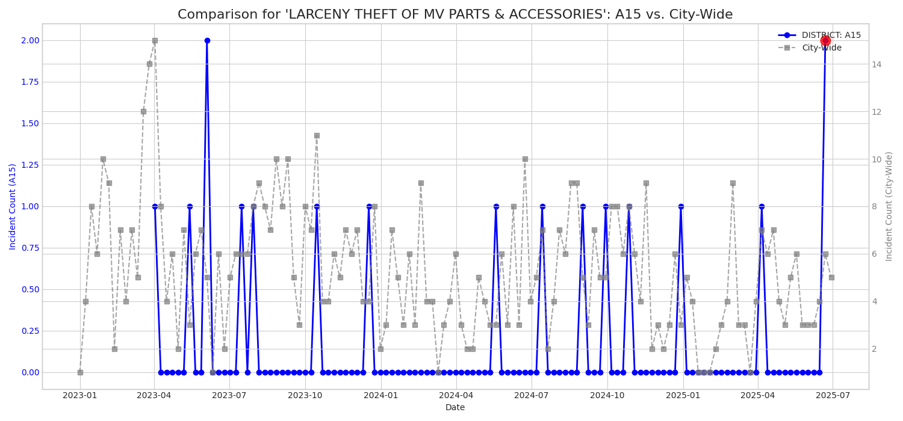

#### Finding 23: Anomaly in 'WARRANT ARREST - OUTSIDE OF BOSTON WARRANT' for C11
- **Date**: 2025-06-29
- **Observed Count**: 4 (Historical Avg: 0.78)
- **Magnitude (Z-Score)**: 3.64
- **Significance (p-value)**: 0.008483
- **City-Wide Context**: The same week was **not significant** for 'WARRANT ARREST - OUTSIDE OF BOSTON WARRANT' across all DISTRICTs (p-value: 0.1553).

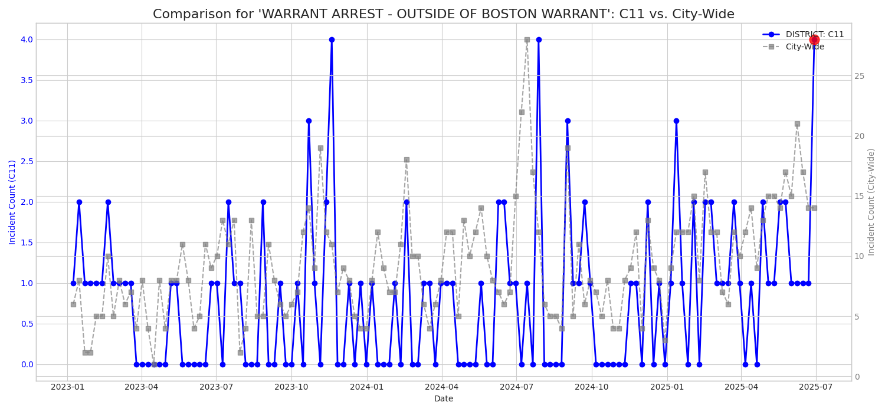

#### Finding 24: Anomaly in 'VAL - VIOLATION OF AUTO LAW' for B3
- **Date**: 2025-06-08
- **Observed Count**: 8 (Historical Avg: 2.64)
- **Magnitude (Z-Score)**: 3.15
- **Significance (p-value)**: 0.008719
- **City-Wide Context**: The same week was **significant** for 'VAL - VIOLATION OF AUTO LAW' across all DISTRICTs (p-value: 0.003587).

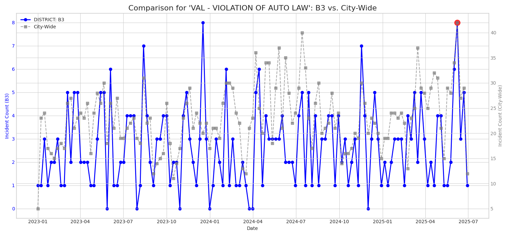

#### Finding 25: Anomaly in 'INVESTIGATE PROPERTY' for A7
- **Date**: 2025-06-08
- **Observed Count**: 9 (Historical Avg: 3.00)
- **Magnitude (Z-Score)**: 3.14
- **Significance (p-value)**: 0.009012
- **City-Wide Context**: The same week was **not significant** for 'INVESTIGATE PROPERTY' across all DISTRICTs (p-value: 0.3374).

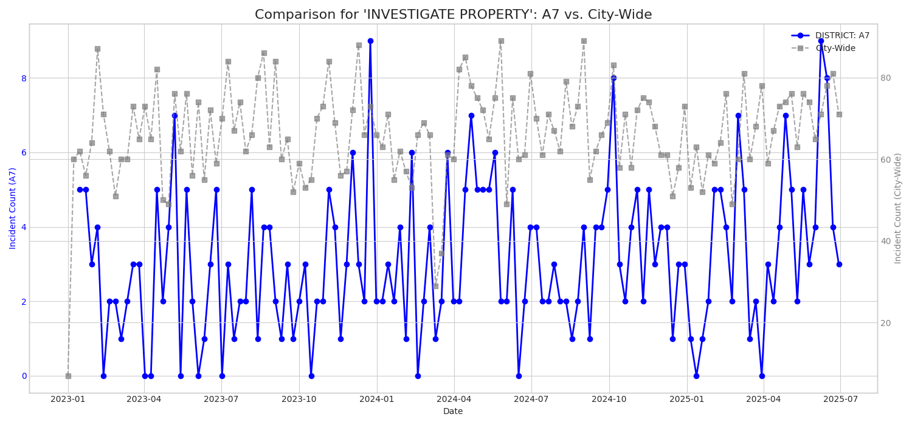

#### Finding 26: Anomaly in 'M/V ACCIDENT - INVOLVING PEDESTRIAN - NO INJURY' for A7
- **Date**: 2025-06-15
- **Observed Count**: 2 (Historical Avg: 0.15)
- **Magnitude (Z-Score)**: 4.85
- **Significance (p-value)**: 0.009718
- **City-Wide Context**: The same week was **significant** for 'M/V ACCIDENT - INVOLVING PEDESTRIAN - NO INJURY' across all DISTRICTs (p-value: 0.03463).

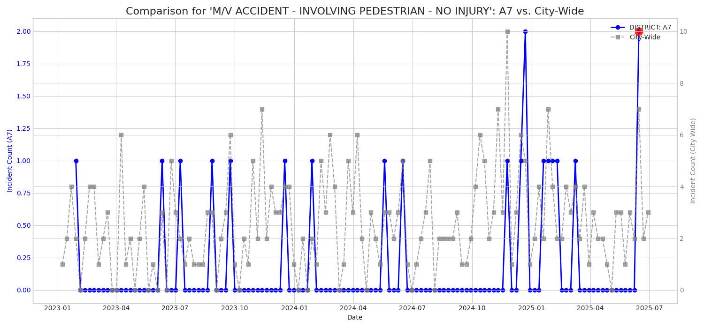

#### Finding 27: Anomaly in 'INVESTIGATE PERSON' for C11
- **Date**: 2025-06-15
- **Observed Count**: 28 (Historical Avg: 16.26)
- **Magnitude (Z-Score)**: 2.66
- **Significance (p-value)**: 0.009896
- **City-Wide Context**: The same week was **not significant** for 'INVESTIGATE PERSON' across all DISTRICTs (p-value: 0.08234).

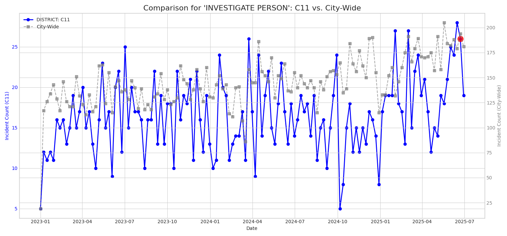

#### Finding 28: Anomaly in 'M/V ACCIDENT - INVOLVING PEDESTRIAN - NO INJURY' for B2
- **Date**: 2025-06-15
- **Observed Count**: 3 (Historical Avg: 0.28)
- **Magnitude (Z-Score)**: 4.55
- **Significance (p-value)**: 0.01006
- **City-Wide Context**: The same week was **significant** for 'M/V ACCIDENT - INVOLVING PEDESTRIAN - NO INJURY' across all DISTRICTs (p-value: 0.03463).

#### Finding 29: Anomaly in 'M/V ACCIDENT - INVOLVING BICYCLE - INJURY' for D14
- **Date**: 2025-06-08
- **Observed Count**: 4 (Historical Avg: 0.59)
- **Magnitude (Z-Score)**: 3.96
- **Significance (p-value)**: 0.01015
- **City-Wide Context**: The same week was **not significant** for 'M/V ACCIDENT - INVOLVING BICYCLE - INJURY' across all DISTRICTs (p-value: 0.09542).

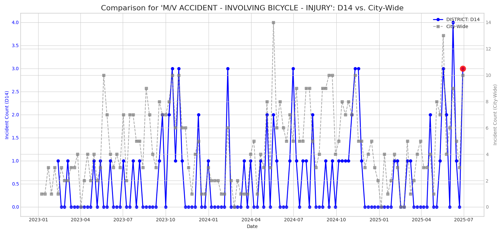

#### Finding 30: Anomaly in 'WARRANT ARREST - OUTSIDE OF BOSTON WARRANT' for D4
- **Date**: 2025-06-08
- **Observed Count**: 6 (Historical Avg: 1.46)
- **Magnitude (Z-Score)**: 3.38
- **Significance (p-value)**: 0.0102
- **City-Wide Context**: The same week was **significant** for 'WARRANT ARREST - OUTSIDE OF BOSTON WARRANT' across all DISTRICTs (p-value: 0.01564).

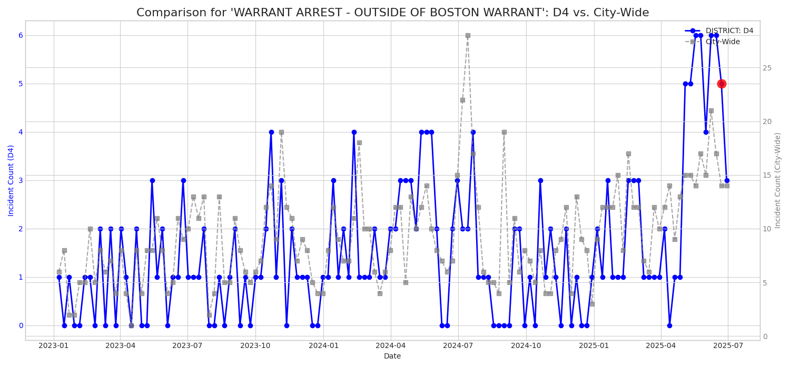

#### Finding 31: Anomaly in 'WARRANT ARREST - OUTSIDE OF BOSTON WARRANT' for D4
- **Date**: 2025-06-15
- **Observed Count**: 6 (Historical Avg: 1.46)
- **Magnitude (Z-Score)**: 3.38
- **Significance (p-value)**: 0.0102
- **City-Wide Context**: The same week was **not significant** for 'WARRANT ARREST - OUTSIDE OF BOSTON WARRANT' across all DISTRICTs (p-value: 0.06252).

#### Finding 32: Trend in 'LARCENY THEFT FROM BUILDING' for D14
- **Description**: Significant Downward Trend
- **Weekly Change (Slope)**: -1.70
- **Significance (p-value)**: 0.01022
- **City-Wide Context**: The trend for 'LARCENY THEFT FROM BUILDING' across all DISTRICTs is: **Significant Downward Trend** (p-value: 0.03408, slope: -6.20).

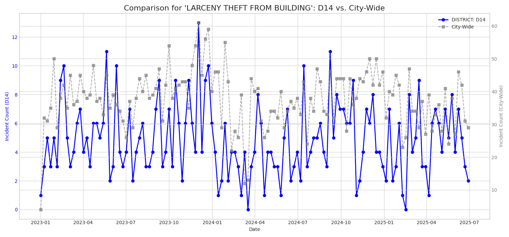

#### Finding 33: Anomaly in 'LARCENY THEFT OF BICYCLE' for C11
- **Date**: 2025-06-08
- **Observed Count**: 3 (Historical Avg: 0.44)
- **Magnitude (Z-Score)**: 3.86
- **Significance (p-value)**: 0.01024
- **City-Wide Context**: The same week was **not significant** for 'LARCENY THEFT OF BICYCLE' across all DISTRICTs (p-value: 0.5409).

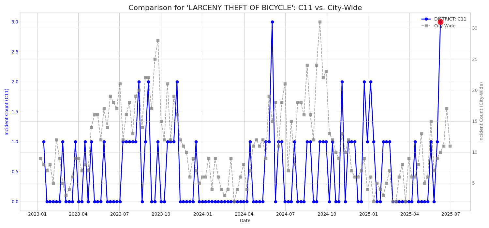

#### Finding 34: Anomaly in 'LARCENY THEFT FROM BUILDING' for C6
- **Date**: 2025-06-08
- **Observed Count**: 10 (Historical Avg: 3.59)
- **Magnitude (Z-Score)**: 3.01
- **Significance (p-value)**: 0.01049
- **City-Wide Context**: The same week was **not significant** for 'LARCENY THEFT FROM BUILDING' across all DISTRICTs (p-value: 0.184).

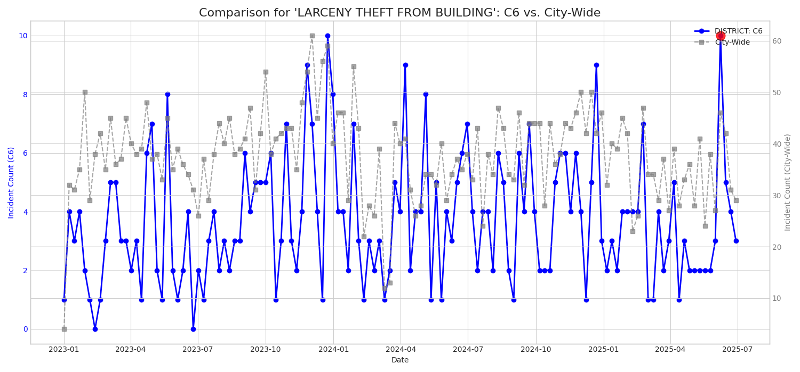

#### Finding 35: Anomaly in 'SEARCH WARRANT' for C6
- **Date**: 2025-06-08
- **Observed Count**: 2 (Historical Avg: 0.09)
- **Magnitude (Z-Score)**: 5.59
- **Significance (p-value)**: 0.01153
- **City-Wide Context**: The same week was **not significant** for 'SEARCH WARRANT' across all DISTRICTs (p-value: 0.06563).

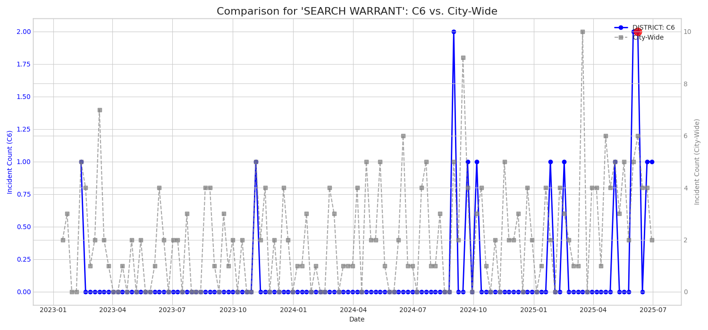

#### Finding 36: Anomaly in 'WARRANT ARREST - OUTSIDE OF BOSTON WARRANT' for A1
- **Date**: 2025-06-08
- **Observed Count**: 6 (Historical Avg: 1.36)
- **Magnitude (Z-Score)**: 3.39
- **Significance (p-value)**: 0.01193
- **City-Wide Context**: The same week was **significant** for 'WARRANT ARREST - OUTSIDE OF BOSTON WARRANT' across all DISTRICTs (p-value: 0.01564).

#### Finding 37: Anomaly in 'SICK/INJURED/MEDICAL - PERSON' for D14
- **Date**: 2025-06-15
- **Observed Count**: 7 (Historical Avg: 2.17)
- **Magnitude (Z-Score)**: 3.06
- **Significance (p-value)**: 0.01208
- **City-Wide Context**: The same week was **not significant** for 'SICK/INJURED/MEDICAL - PERSON' across all DISTRICTs (p-value: 0.3699).

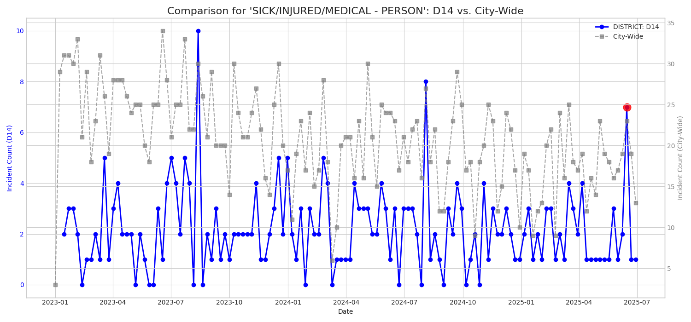

#### Finding 38: Anomaly in 'PROPERTY - LOST/ MISSING' for D14
- **Date**: 2025-06-08
- **Observed Count**: 9 (Historical Avg: 3.31)
- **Magnitude (Z-Score)**: 2.88
- **Significance (p-value)**: 0.0129
- **City-Wide Context**: The same week was **not significant** for 'PROPERTY - LOST/ MISSING' across all DISTRICTs (p-value: 0.1155).

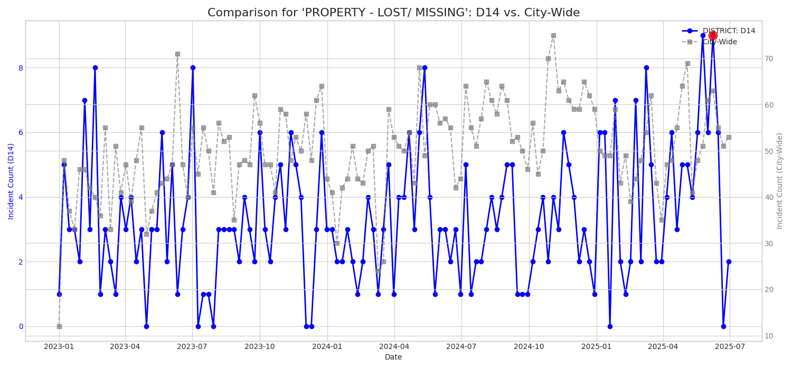

#### Finding 39: Anomaly in 'LARCENY SHOPLIFTING' for B2
- **Date**: 2025-06-08
- **Observed Count**: 10 (Historical Avg: 3.46)
- **Magnitude (Z-Score)**: 2.91
- **Significance (p-value)**: 0.01392
- **City-Wide Context**: The same week was **not significant** for 'LARCENY SHOPLIFTING' across all DISTRICTs (p-value: 0.2285).

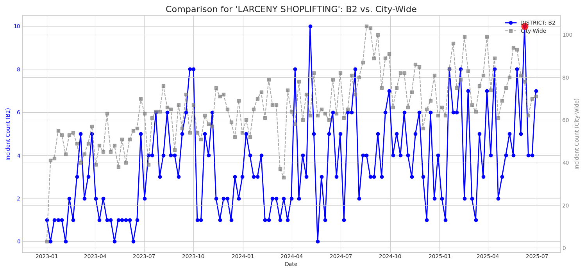

#### Finding 40: Anomaly in 'DRUGS - POSSESSION/ SALE/ MANUFACTURING/ USE' for D4
- **Date**: 2025-06-08
- **Observed Count**: 16 (Historical Avg: 3.92)
- **Magnitude (Z-Score)**: 3.18
- **Significance (p-value)**: 0.01514
- **City-Wide Context**: The same week was **not significant** for 'DRUGS - POSSESSION/ SALE/ MANUFACTURING/ USE' across all DISTRICTs (p-value: 0.192).

#### Finding 41: Anomaly in 'DRUGS - POSSESSION/ SALE/ MANUFACTURING/ USE' for D4
- **Date**: 2025-06-15
- **Observed Count**: 16 (Historical Avg: 3.92)
- **Magnitude (Z-Score)**: 3.18
- **Significance (p-value)**: 0.01514
- **City-Wide Context**: The same week was **not significant** for 'DRUGS - POSSESSION/ SALE/ MANUFACTURING/ USE' across all DISTRICTs (p-value: 0.6237).

#### Finding 42: Trend in 'LARCENY THEFT FROM BUILDING' for A1
- **Description**: Significant Downward Trend
- **Weekly Change (Slope)**: -2.10
- **Significance (p-value)**: 0.0155
- **City-Wide Context**: The trend for 'LARCENY THEFT FROM BUILDING' across all DISTRICTs is: **Significant Downward Trend** (p-value: 0.03408, slope: -6.20).

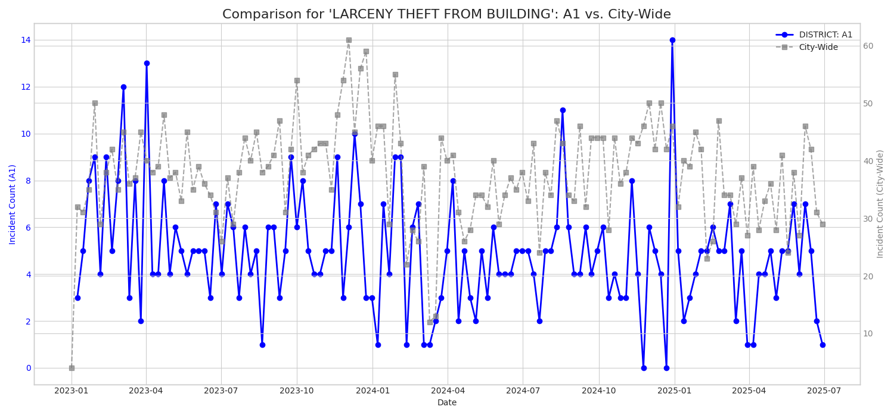

#### Finding 43: Anomaly in 'M/V PLATES - LOST' for A7
- **Date**: 2025-06-29
- **Observed Count**: 2 (Historical Avg: 0.19)
- **Magnitude (Z-Score)**: 4.15
- **Significance (p-value)**: 0.01599
- **City-Wide Context**: The same week was **not significant** for 'M/V PLATES - LOST' across all DISTRICTs (p-value: 0.2991).

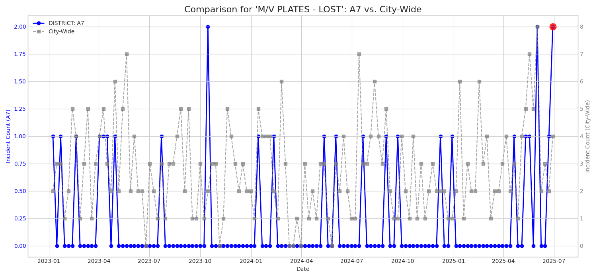

#### Finding 44: Anomaly in 'M/V ACCIDENT - POLICE VEHICLE' for C11
- **Date**: 2025-06-08
- **Observed Count**: 3 (Historical Avg: 0.53)
- **Magnitude (Z-Score)**: 3.40
- **Significance (p-value)**: 0.0166
- **City-Wide Context**: The same week was **not significant** for 'M/V ACCIDENT - POLICE VEHICLE' across all DISTRICTs (p-value: 0.2286).

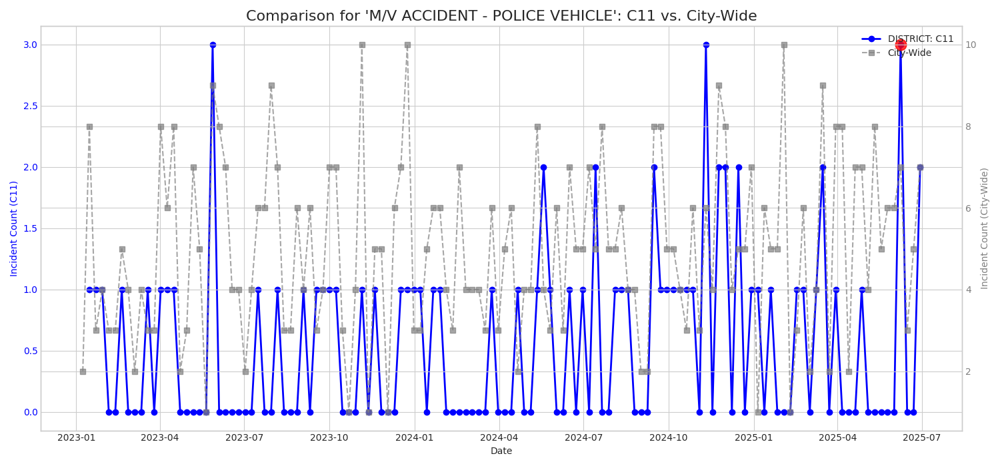

#### Finding 45: Anomaly in 'LARCENY ALL OTHERS' for B2
- **Date**: 2025-06-15
- **Observed Count**: 10 (Historical Avg: 4.17)
- **Magnitude (Z-Score)**: 2.66
- **Significance (p-value)**: 0.01707
- **City-Wide Context**: The same week was **not significant** for 'LARCENY ALL OTHERS' across all DISTRICTs (p-value: 0.4096).

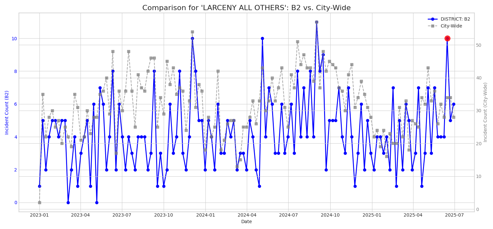

#### Finding 46: Anomaly in 'INVESTIGATE PERSON' for E5
- **Date**: 2025-06-22
- **Observed Count**: 17 (Historical Avg: 8.17)
- **Magnitude (Z-Score)**: 2.54
- **Significance (p-value)**: 0.01803
- **City-Wide Context**: The same week was **significant** for 'INVESTIGATE PERSON' across all DISTRICTs (p-value: 0.0268).

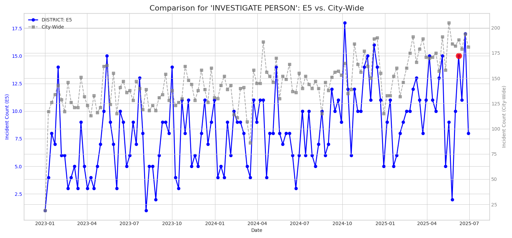

#### Finding 47: Trend in 'SICK ASSIST' for A7
- **Description**: Significant Downward Trend
- **Weekly Change (Slope)**: -1.90
- **Significance (p-value)**: 0.01884
- **City-Wide Context**: The trend for 'SICK ASSIST' across all DISTRICTs is: **Not Significant** (p-value: 0.2967, slope: -7.30).

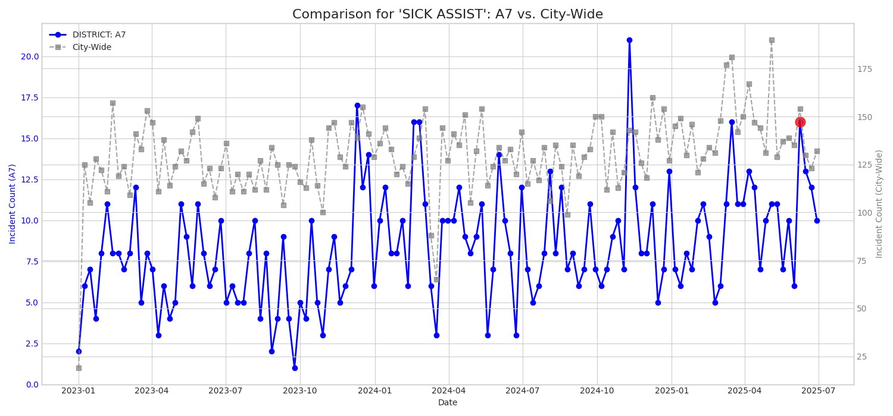

#### Finding 48: Trend in 'PROPERTY - LOST/ MISSING' for C6
- **Description**: Significant Upward Trend
- **Weekly Change (Slope)**: 1.90
- **Significance (p-value)**: 0.01884
- **City-Wide Context**: The trend for 'PROPERTY - LOST/ MISSING' across all DISTRICTs is: **Not Significant** (p-value: 0.1655, slope: -3.40).

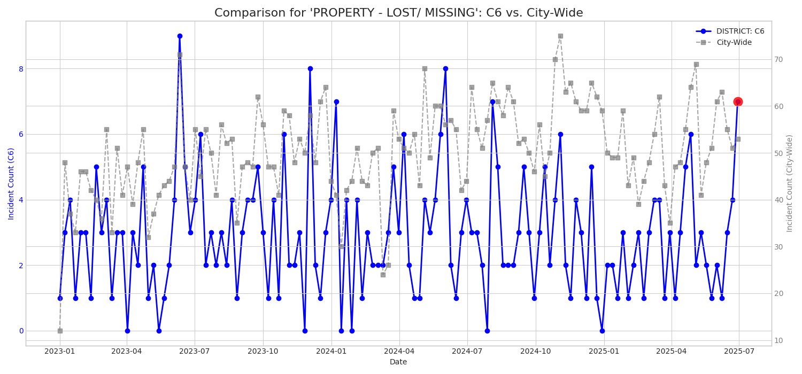

#### Finding 49: Trend in 'M/V - LEAVING SCENE - PROPERTY DAMAGE' for D14
- **Description**: Significant Downward Trend
- **Weekly Change (Slope)**: -1.90
- **Significance (p-value)**: 0.01884
- **City-Wide Context**: The trend for 'M/V - LEAVING SCENE - PROPERTY DAMAGE' across all DISTRICTs is: **Not Significant** (p-value: 0.5111, slope: -4.40).

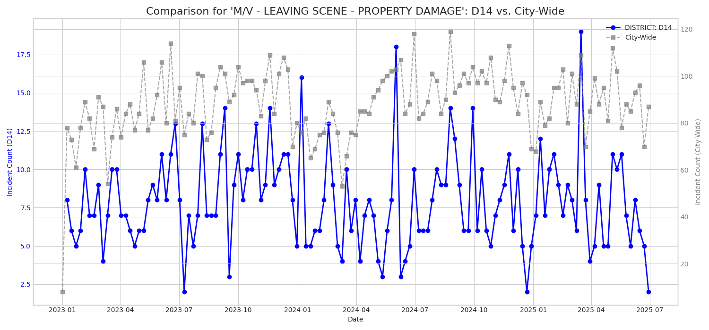

#### Finding 50: Anomaly in 'TOWED MOTOR VEHICLE' for C11
- **Date**: 2025-06-08
- **Observed Count**: 15 (Historical Avg: 7.65)
- **Magnitude (Z-Score)**: 2.45
- **Significance (p-value)**: 0.01968
- **City-Wide Context**: The same week was **not significant** for 'TOWED MOTOR VEHICLE' across all DISTRICTs (p-value: 0.1859).

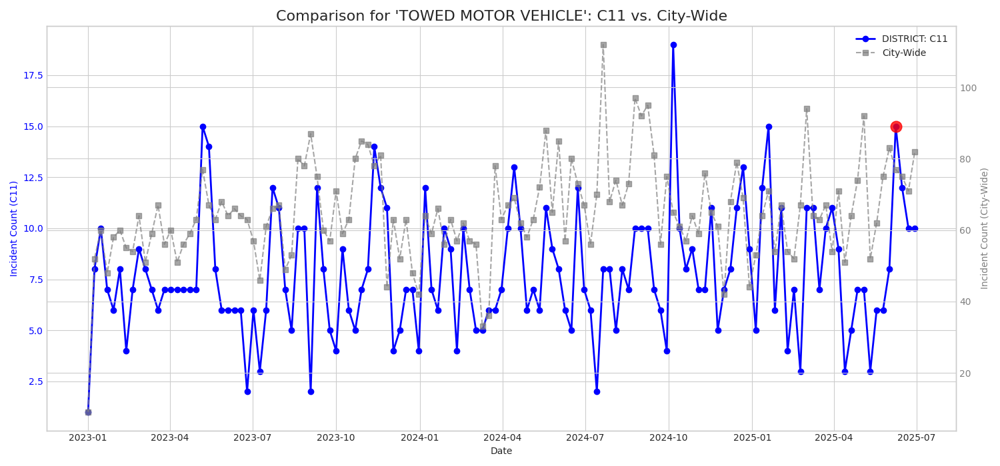

#### Finding 51: Anomaly in 'INVESTIGATE PERSON' for E13
- **Date**: 2025-06-22
- **Observed Count**: 18 (Historical Avg: 9.06)
- **Magnitude (Z-Score)**: 2.46
- **Significance (p-value)**: 0.01987
- **City-Wide Context**: The same week was **significant** for 'INVESTIGATE PERSON' across all DISTRICTs (p-value: 0.0268).

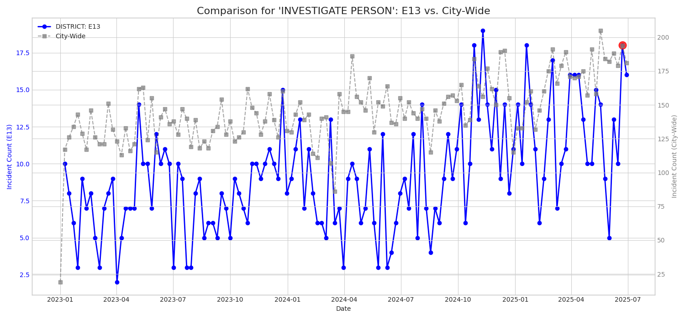

#### Finding 52: Anomaly in 'M/V ACCIDENT - INVOLVING BICYCLE - INJURY' for C11
- **Date**: 2025-06-08
- **Observed Count**: 3 (Historical Avg: 0.47)
- **Magnitude (Z-Score)**: 3.44
- **Significance (p-value)**: 0.01998
- **City-Wide Context**: The same week was **not significant** for 'M/V ACCIDENT - INVOLVING BICYCLE - INJURY' across all DISTRICTs (p-value: 0.09542).

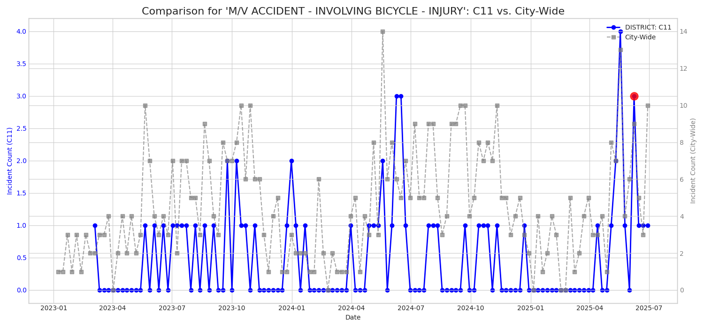

#### Finding 53: Anomaly in 'VANDALISM' for C11
- **Date**: 2025-06-15
- **Observed Count**: 16 (Historical Avg: 7.00)
- **Magnitude (Z-Score)**: 2.55
- **Significance (p-value)**: 0.02018
- **City-Wide Context**: The same week was **not significant** for 'VANDALISM' across all DISTRICTs (p-value: 0.3164).

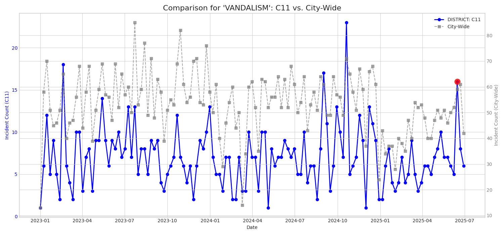

#### Finding 54: Anomaly in 'TOWED MOTOR VEHICLE' for A1
- **Date**: 2025-06-08
- **Observed Count**: 13 (Historical Avg: 6.65)
- **Magnitude (Z-Score)**: 2.42
- **Significance (p-value)**: 0.02094
- **City-Wide Context**: The same week was **not significant** for 'TOWED MOTOR VEHICLE' across all DISTRICTs (p-value: 0.1859).

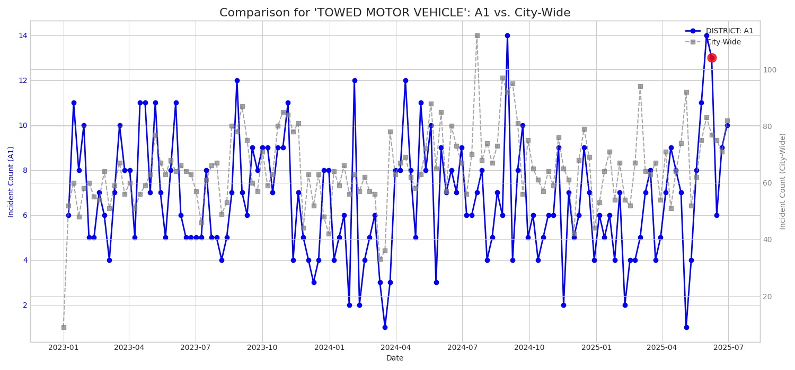

#### Finding 55: Anomaly in 'SICK ASSIST' for C11
- **Date**: 2025-06-15
- **Observed Count**: 21 (Historical Avg: 12.31)
- **Magnitude (Z-Score)**: 2.33
- **Significance (p-value)**: 0.0212
- **City-Wide Context**: The same week was **not significant** for 'SICK ASSIST' across all DISTRICTs (p-value: 0.4903).

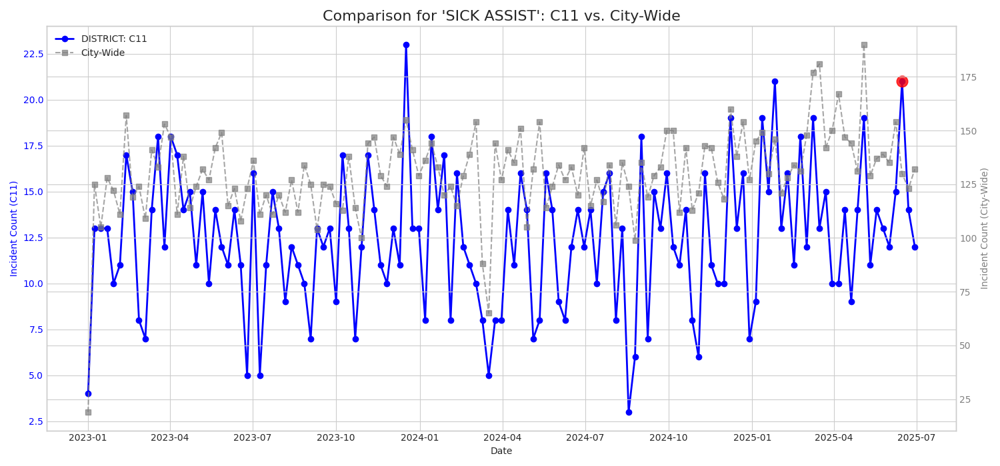

#### Finding 56: Anomaly in 'SUDDEN DEATH' for E13
- **Date**: 2025-06-29
- **Observed Count**: 3 (Historical Avg: 0.58)
- **Magnitude (Z-Score)**: 3.17
- **Significance (p-value)**: 0.02139
- **City-Wide Context**: The same week was **not significant** for 'SUDDEN DEATH' across all DISTRICTs (p-value: 0.7993).

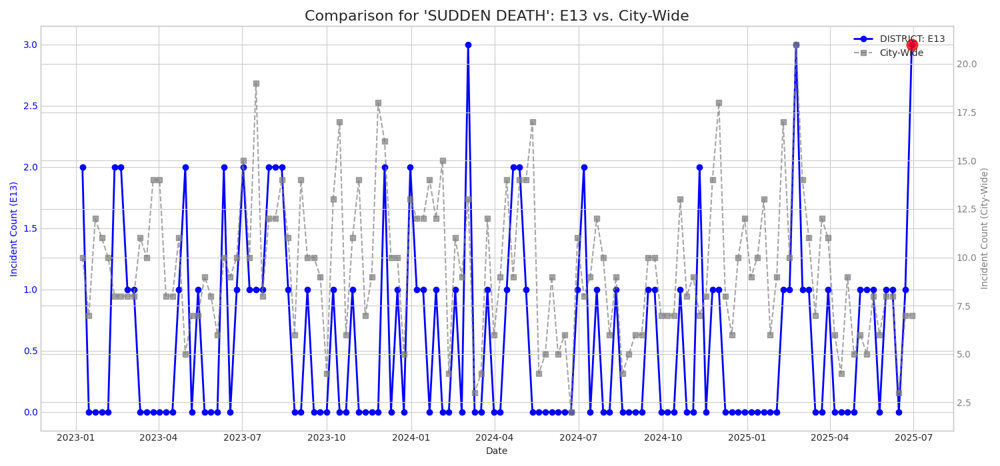

#### Finding 57: Anomaly in 'VERBAL DISPUTE' for A7
- **Date**: 2025-06-15
- **Observed Count**: 6 (Historical Avg: 1.99)
- **Magnitude (Z-Score)**: 2.71
- **Significance (p-value)**: 0.02144
- **City-Wide Context**: The same week was **not significant** for 'VERBAL DISPUTE' across all DISTRICTs (p-value: 0.2034).

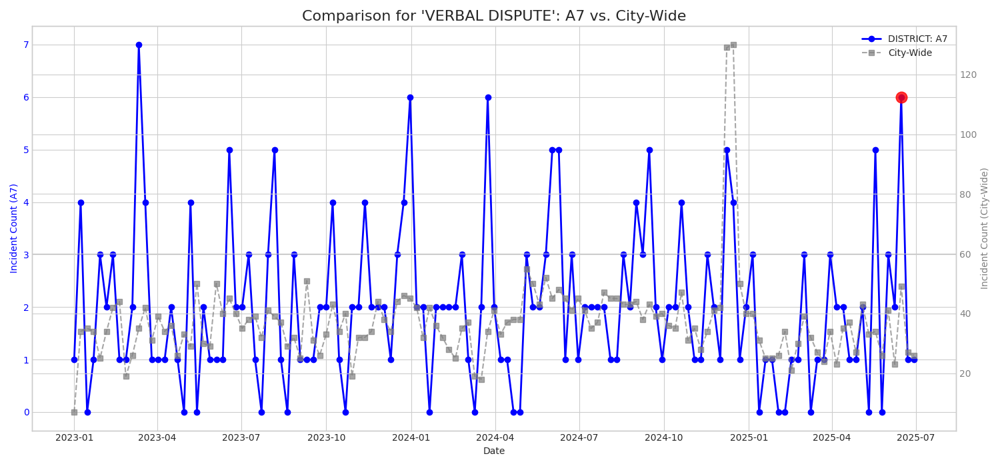

#### Finding 58: Anomaly in 'INVESTIGATE PROPERTY' for A7
- **Date**: 2025-06-15
- **Observed Count**: 8 (Historical Avg: 3.00)
- **Magnitude (Z-Score)**: 2.62
- **Significance (p-value)**: 0.02166
- **City-Wide Context**: The same week was **not significant** for 'INVESTIGATE PROPERTY' across all DISTRICTs (p-value: 0.1638).

#### Finding 59: Anomaly in 'VAL - VIOLATION OF AUTO LAW' for E5
- **Date**: 2025-06-22
- **Observed Count**: 3 (Historical Avg: 0.44)
- **Magnitude (Z-Score)**: 3.42
- **Significance (p-value)**: 0.02214
- **City-Wide Context**: The same week was **not significant** for 'VAL - VIOLATION OF AUTO LAW' across all DISTRICTs (p-value: 0.1735).

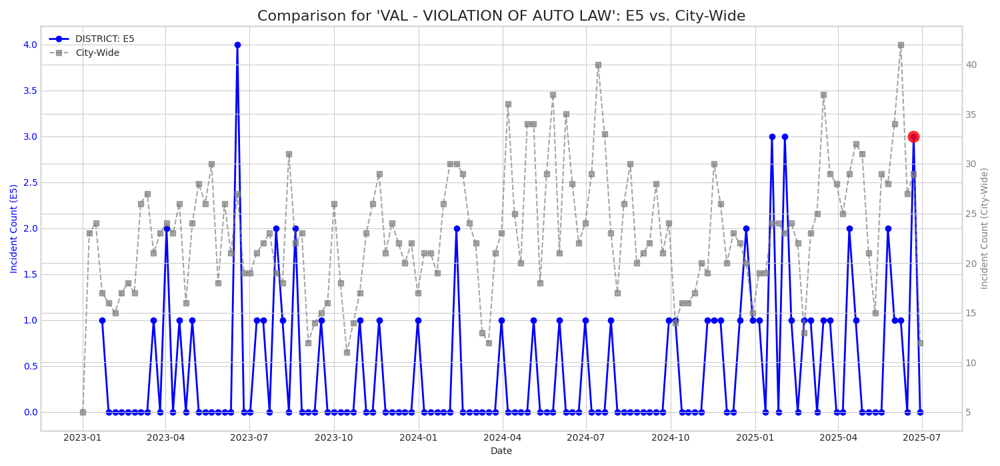

#### Finding 60: Anomaly in 'VIOLATION - CITY ORDINANCE' for B3
- **Date**: 2025-06-08
- **Observed Count**: 2 (Historical Avg: 0.16)
- **Magnitude (Z-Score)**: 4.11
- **Significance (p-value)**: 0.0227
- **City-Wide Context**: The same week was **not significant** for 'VIOLATION - CITY ORDINANCE' across all DISTRICTs (p-value: 0.2048).

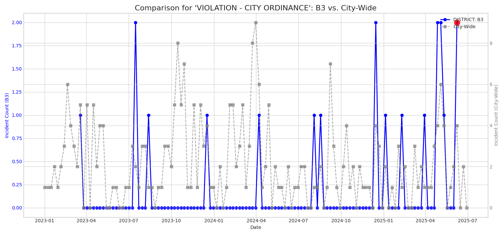

#### Finding 61: Anomaly in 'DRUGS - POSSESSION/ SALE/ MANUFACTURING/ USE' for E18
- **Date**: 2025-06-22
- **Observed Count**: 4 (Historical Avg: 1.00)
- **Magnitude (Z-Score)**: 2.90
- **Significance (p-value)**: 0.02334
- **City-Wide Context**: The same week was **not significant** for 'DRUGS - POSSESSION/ SALE/ MANUFACTURING/ USE' across all DISTRICTs (p-value: 0.1501).

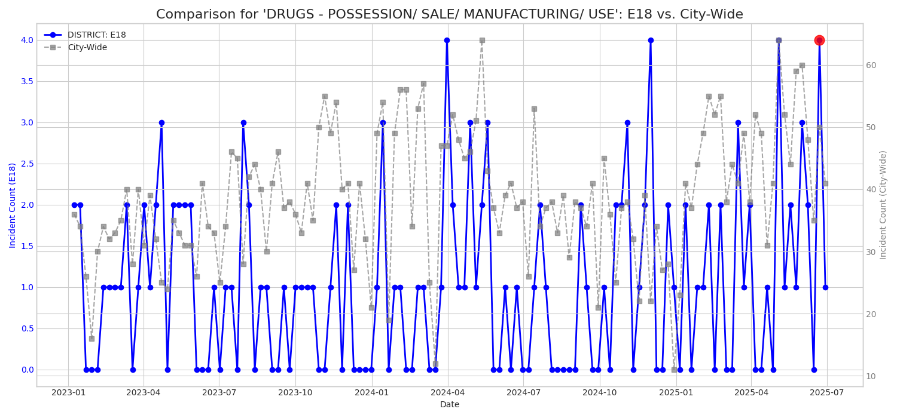

#### Finding 62: Anomaly in 'ASSAULT - SIMPLE' for D4
- **Date**: 2025-06-29
- **Observed Count**: 18 (Historical Avg: 9.84)
- **Magnitude (Z-Score)**: 2.30
- **Significance (p-value)**: 0.02452
- **City-Wide Context**: The same week was **not significant** for 'ASSAULT - SIMPLE' across all DISTRICTs (p-value: 0.681).

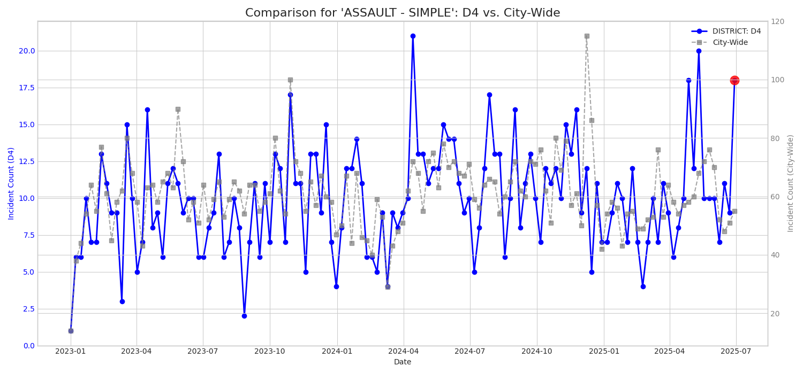

#### Finding 63: Anomaly in 'RECOVERED - MV RECOVERED IN BOSTON (STOLEN OUTSIDE BOSTON)' for B3
- **Date**: 2025-06-08
- **Observed Count**: 3 (Historical Avg: 0.62)
- **Magnitude (Z-Score)**: 3.04
- **Significance (p-value)**: 0.02473
- **City-Wide Context**: The same week was **not significant** for 'RECOVERED - MV RECOVERED IN BOSTON (STOLEN OUTSIDE BOSTON)' across all DISTRICTs (p-value: 0.5952).

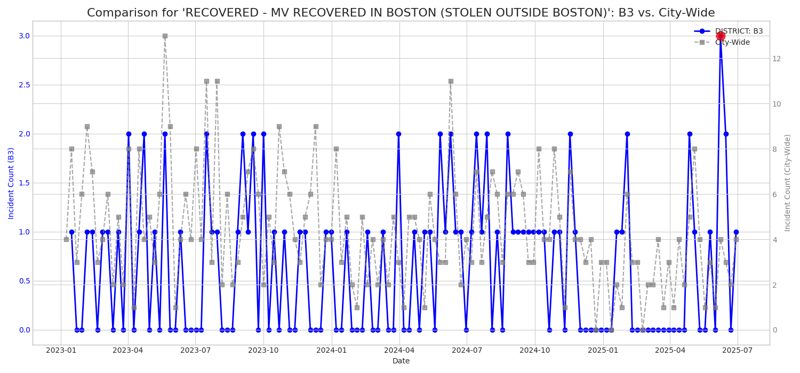

#### Finding 64: Anomaly in 'INVESTIGATE PERSON' for C11
- **Date**: 2025-06-22
- **Observed Count**: 26 (Historical Avg: 16.26)
- **Magnitude (Z-Score)**: 2.21
- **Significance (p-value)**: 0.02514
- **City-Wide Context**: The same week was **significant** for 'INVESTIGATE PERSON' across all DISTRICTs (p-value: 0.0268).

#### Finding 65: Anomaly in 'SICK ASSIST' for A7
- **Date**: 2025-06-08
- **Observed Count**: 16 (Historical Avg: 8.22)
- **Magnitude (Z-Score)**: 2.33
- **Significance (p-value)**: 0.02517
- **City-Wide Context**: The same week was **not significant** for 'SICK ASSIST' across all DISTRICTs (p-value: 0.1234).

#### Finding 66: Anomaly in 'DEATH INVESTIGATION' for A1
- **Date**: 2025-06-22
- **Observed Count**: 3 (Historical Avg: 0.56)
- **Magnitude (Z-Score)**: 3.10
- **Significance (p-value)**: 0.02544
- **City-Wide Context**: The same week was **not significant** for 'DEATH INVESTIGATION' across all DISTRICTs (p-value: 0.05768).

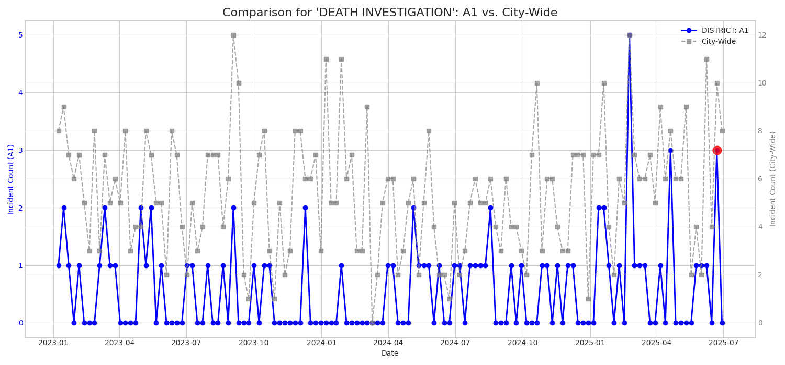

#### Finding 67: Anomaly in 'LARCENY ALL OTHERS' for C11
- **Date**: 2025-06-22
- **Observed Count**: 10 (Historical Avg: 4.53)
- **Magnitude (Z-Score)**: 2.39
- **Significance (p-value)**: 0.02618
- **City-Wide Context**: The same week was **not significant** for 'LARCENY ALL OTHERS' across all DISTRICTs (p-value: 0.4096).

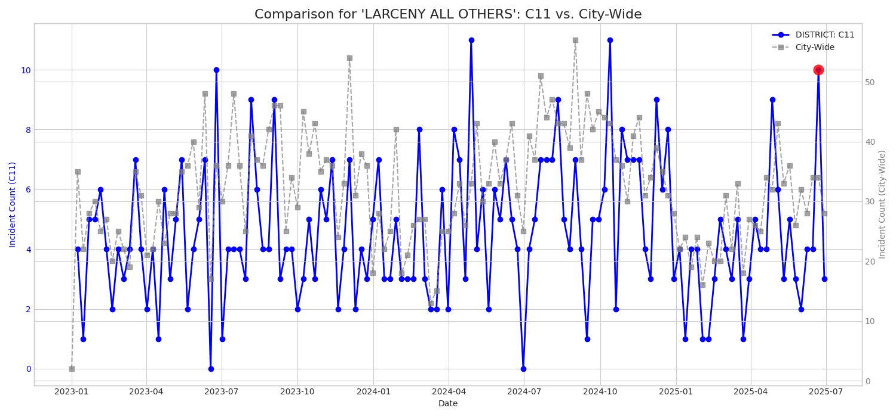

#### Finding 68: Anomaly in 'FIRE REPORT' for B3
- **Date**: 2025-06-29
- **Observed Count**: 4 (Historical Avg: 1.10)
- **Magnitude (Z-Score)**: 2.76
- **Significance (p-value)**: 0.02638
- **City-Wide Context**: The same week was **not significant** for 'FIRE REPORT' across all DISTRICTs (p-value: 0.0586).

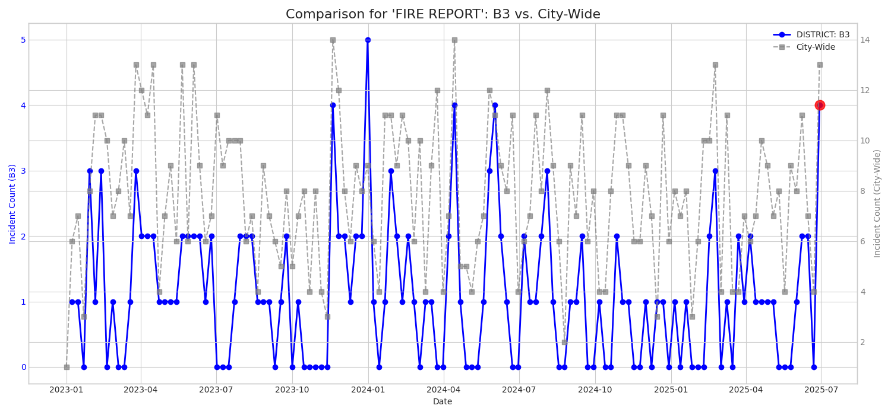

#### Finding 69: Anomaly in 'MISSING PERSON - LOCATED' for B2
- **Date**: 2025-06-08
- **Observed Count**: 11 (Historical Avg: 5.13)
- **Magnitude (Z-Score)**: 2.37
- **Significance (p-value)**: 0.02638
- **City-Wide Context**: The same week was **not significant** for 'MISSING PERSON - LOCATED' across all DISTRICTs (p-value: 0.6479).

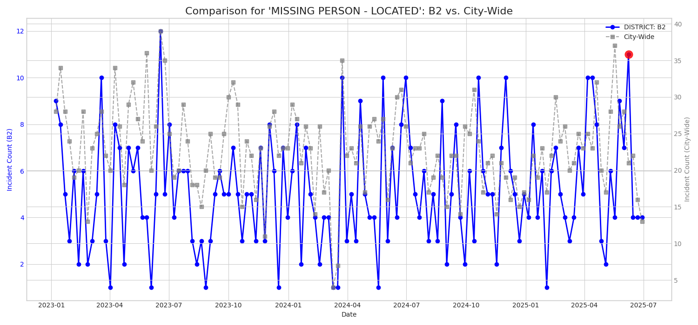

#### Finding 70: Anomaly in 'M/V ACCIDENT - PERSONAL INJURY' for B3
- **Date**: 2025-06-22
- **Observed Count**: 7 (Historical Avg: 2.67)
- **Magnitude (Z-Score)**: 2.51
- **Significance (p-value)**: 0.02645
- **City-Wide Context**: The same week was **not significant** for 'M/V ACCIDENT - PERSONAL INJURY' across all DISTRICTs (p-value: 0.7928).

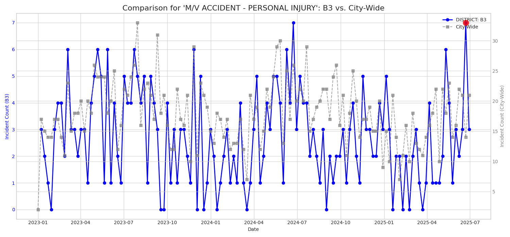

#### Finding 71: Anomaly in 'MISSING PERSON - NOT REPORTED - LOCATED' for E18
- **Date**: 2025-06-08
- **Observed Count**: 2 (Historical Avg: 0.25)
- **Magnitude (Z-Score)**: 3.50
- **Significance (p-value)**: 0.0265
- **City-Wide Context**: The same week was **not significant** for 'MISSING PERSON - NOT REPORTED - LOCATED' across all DISTRICTs (p-value: 0.4192).

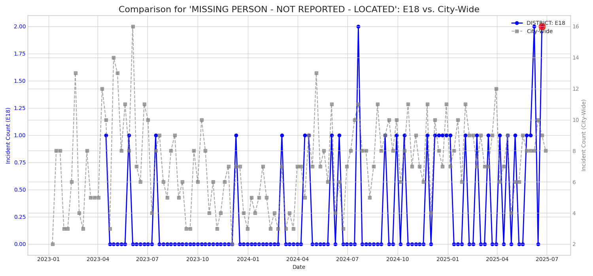

#### Finding 72: Anomaly in 'MISSING PERSON - NOT REPORTED - LOCATED' for E18
- **Date**: 2025-06-22
- **Observed Count**: 2 (Historical Avg: 0.25)
- **Magnitude (Z-Score)**: 3.50
- **Significance (p-value)**: 0.0265
- **City-Wide Context**: The same week was **not significant** for 'MISSING PERSON - NOT REPORTED - LOCATED' across all DISTRICTs (p-value: 0.2928).

#### Finding 73: Anomaly in 'INVESTIGATE PROPERTY' for D14
- **Date**: 2025-06-15
- **Observed Count**: 10 (Historical Avg: 3.91)
- **Magnitude (Z-Score)**: 2.47
- **Significance (p-value)**: 0.02688
- **City-Wide Context**: The same week was **not significant** for 'INVESTIGATE PROPERTY' across all DISTRICTs (p-value: 0.1638).

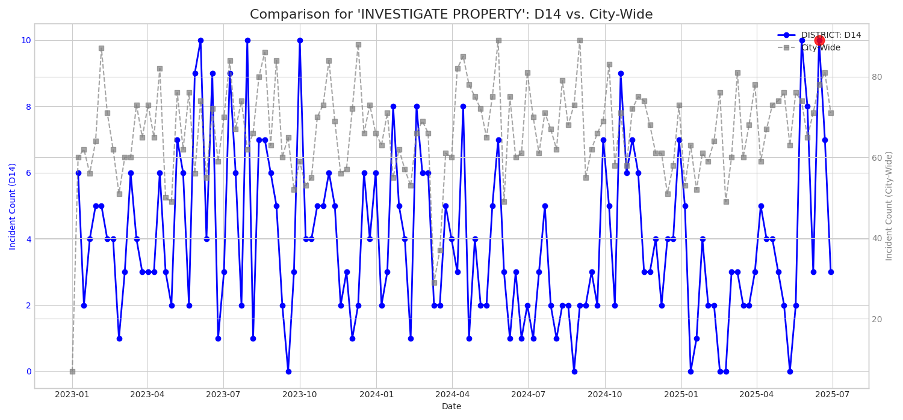

#### Finding 74: Anomaly in 'SICK/INJURED/MEDICAL - PERSON' for E18
- **Date**: 2025-06-08
- **Observed Count**: 6 (Historical Avg: 2.10)
- **Magnitude (Z-Score)**: 2.55
- **Significance (p-value)**: 0.02717
- **City-Wide Context**: The same week was **not significant** for 'SICK/INJURED/MEDICAL - PERSON' across all DISTRICTs (p-value: 0.6319).

#### Finding 75: Anomaly in 'SERVICE TO OTHER AGENCY' for D4
- **Date**: 2025-06-08
- **Observed Count**: 5 (Historical Avg: 1.63)
- **Magnitude (Z-Score)**: 2.60
- **Significance (p-value)**: 0.02728
- **City-Wide Context**: The same week was **not significant** for 'SERVICE TO OTHER AGENCY' across all DISTRICTs (p-value: 0.1777).

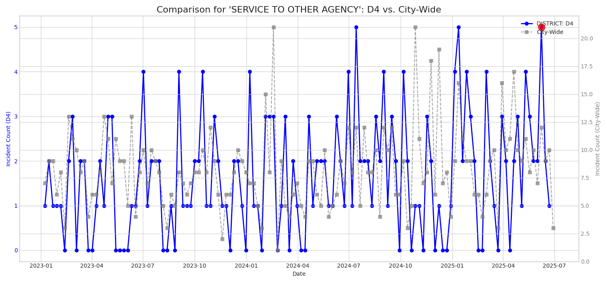

#### Finding 76: Anomaly in 'DEATH INVESTIGATION' for E13
- **Date**: 2025-06-08
- **Observed Count**: 2 (Historical Avg: 0.26)
- **Magnitude (Z-Score)**: 3.44
- **Significance (p-value)**: 0.02783
- **City-Wide Context**: The same week was **significant** for 'DEATH INVESTIGATION' across all DISTRICTs (p-value: 0.0297).

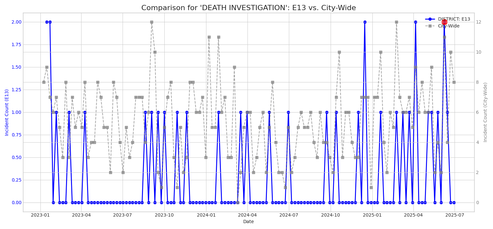

#### Finding 77: Anomaly in 'LARCENY THEFT OF BICYCLE' for B2
- **Date**: 2025-06-22
- **Observed Count**: 4 (Historical Avg: 0.96)
- **Magnitude (Z-Score)**: 2.82
- **Significance (p-value)**: 0.02833
- **City-Wide Context**: The same week was **not significant** for 'LARCENY THEFT OF BICYCLE' across all DISTRICTs (p-value: 0.1768).

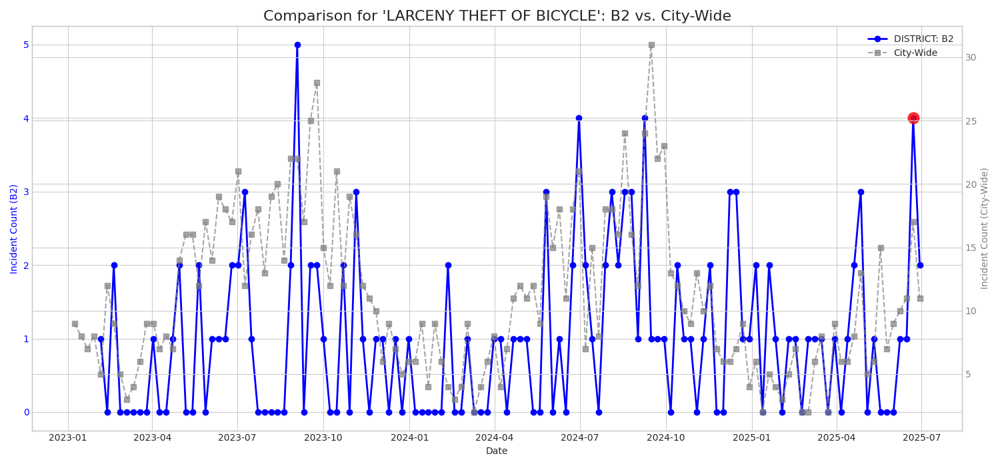

#### Finding 78: Anomaly in 'VANDALISM' for D14
- **Date**: 2025-06-22
- **Observed Count**: 8 (Historical Avg: 3.49)
- **Magnitude (Z-Score)**: 2.38
- **Significance (p-value)**: 0.02845
- **City-Wide Context**: The same week was **not significant** for 'VANDALISM' across all DISTRICTs (p-value: 0.2636).

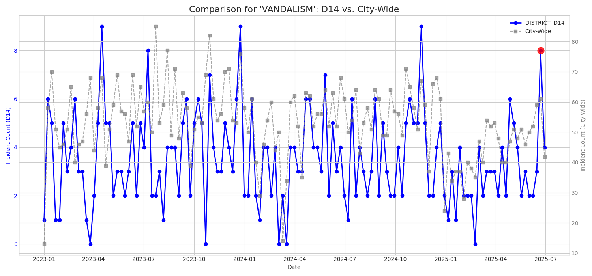

#### Finding 79: Anomaly in 'WARRANT ARREST - BOSTON WARRANT (MUST BE SUPPLEMENTAL)' for B2
- **Date**: 2025-06-15
- **Observed Count**: 2 (Historical Avg: 0.21)
- **Magnitude (Z-Score)**: 3.57
- **Significance (p-value)**: 0.02908
- **City-Wide Context**: The same week was **not significant** for 'WARRANT ARREST - BOSTON WARRANT (MUST BE SUPPLEMENTAL)' across all DISTRICTs (p-value: 0.4866).

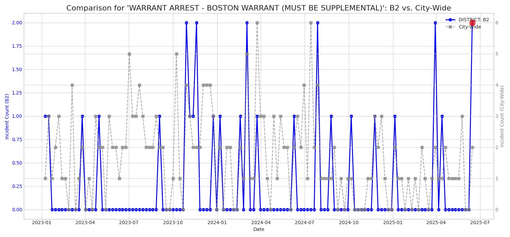

#### Finding 80: Anomaly in 'WARRANT ARREST - OUTSIDE OF BOSTON WARRANT' for D4
- **Date**: 2025-06-22
- **Observed Count**: 5 (Historical Avg: 1.46)
- **Magnitude (Z-Score)**: 2.64
- **Significance (p-value)**: 0.02959
- **City-Wide Context**: The same week was **not significant** for 'WARRANT ARREST - OUTSIDE OF BOSTON WARRANT' across all DISTRICTs (p-value: 0.1553).

#### Finding 81: Anomaly in 'INVESTIGATE PERSON' for A1
- **Date**: 2025-06-08
- **Observed Count**: 23 (Historical Avg: 14.47)
- **Magnitude (Z-Score)**: 2.12
- **Significance (p-value)**: 0.03042
- **City-Wide Context**: The same week was **significant** for 'INVESTIGATE PERSON' across all DISTRICTs (p-value: 0.043).

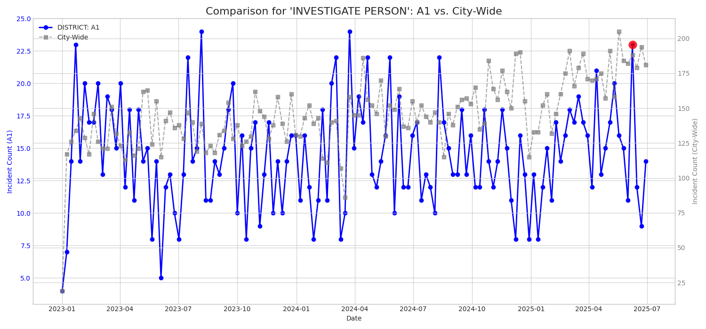

#### Finding 82: Anomaly in 'FIREARM/WEAPON - FOUND OR CONFISCATED' for B2
- **Date**: 2025-06-15
- **Observed Count**: 3 (Historical Avg: 0.62)
- **Magnitude (Z-Score)**: 2.90
- **Significance (p-value)**: 0.03083
- **City-Wide Context**: The same week was **not significant** for 'FIREARM/WEAPON - FOUND OR CONFISCATED' across all DISTRICTs (p-value: 0.1595).

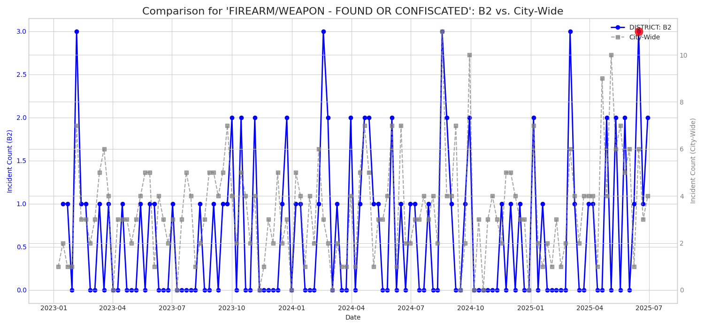

#### Finding 83: Anomaly in 'ASSAULT - AGGRAVATED' for B2
- **Date**: 2025-06-08
- **Observed Count**: 10 (Historical Avg: 4.76)
- **Magnitude (Z-Score)**: 2.26
- **Significance (p-value)**: 0.03176
- **City-Wide Context**: The same week was **not significant** for 'ASSAULT - AGGRAVATED' across all DISTRICTs (p-value: 0.1814).

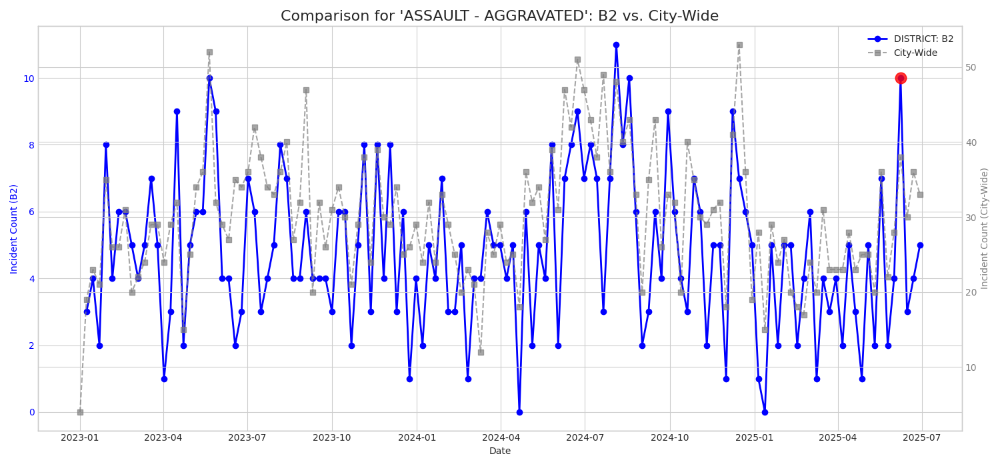

#### Finding 84: Anomaly in 'M/V ACCIDENT - OTHER CITY VEHICLE' for D14
- **Date**: 2025-06-08
- **Observed Count**: 2 (Historical Avg: 0.27)
- **Magnitude (Z-Score)**: 3.26
- **Significance (p-value)**: 0.03312
- **City-Wide Context**: The same week was **not significant** for 'M/V ACCIDENT - OTHER CITY VEHICLE' across all DISTRICTs (p-value: 0.7172).

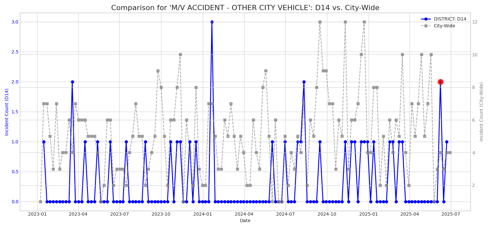

#### Finding 85: Anomaly in 'BALLISTICS EVIDENCE/FOUND' for C6
- **Date**: 2025-06-29
- **Observed Count**: 2 (Historical Avg: 0.28)
- **Magnitude (Z-Score)**: 3.23
- **Significance (p-value)**: 0.03331
- **City-Wide Context**: The same week was **not significant** for 'BALLISTICS EVIDENCE/FOUND' across all DISTRICTs (p-value: 0.06313).

#### Finding 86: Anomaly in 'MISSING PERSON' for C11
- **Date**: 2025-06-29
- **Observed Count**: 4 (Historical Avg: 0.87)
- **Magnitude (Z-Score)**: 2.75
- **Significance (p-value)**: 0.03416
- **City-Wide Context**: The same week was **not significant** for 'MISSING PERSON' across all DISTRICTs (p-value: 0.0697).

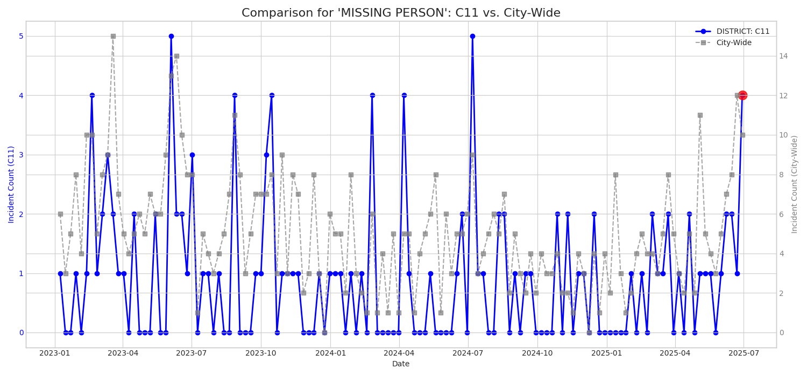

#### Finding 87: Anomaly in 'AUTO THEFT - MOTORCYCLE / SCOOTER' for C6
- **Date**: 2025-06-22
- **Observed Count**: 2 (Historical Avg: 0.28)
- **Magnitude (Z-Score)**: 3.23
- **Significance (p-value)**: 0.03419
- **City-Wide Context**: The same week was **significant** for 'AUTO THEFT - MOTORCYCLE / SCOOTER' across all DISTRICTs (p-value: 0.006913).

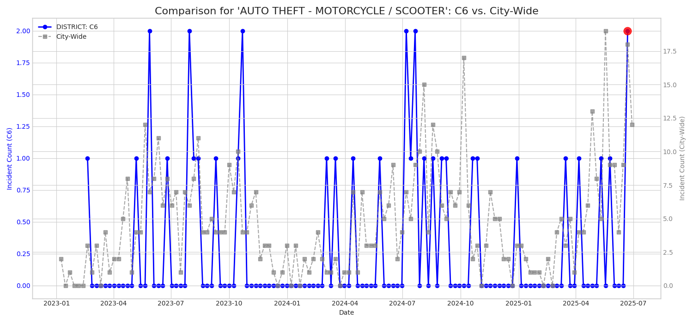

#### Finding 88: Anomaly in 'TRESPASSING' for D4
- **Date**: 2025-06-22
- **Observed Count**: 4 (Historical Avg: 1.15)
- **Magnitude (Z-Score)**: 2.57
- **Significance (p-value)**: 0.03446
- **City-Wide Context**: The same week was **not significant** for 'TRESPASSING' across all DISTRICTs (p-value: 0.3385).

#### Finding 89: Anomaly in 'LARCENY THEFT OF BICYCLE' for A7
- **Date**: 2025-06-22
- **Observed Count**: 2 (Historical Avg: 0.26)
- **Magnitude (Z-Score)**: 3.26
- **Significance (p-value)**: 0.03447
- **City-Wide Context**: The same week was **not significant** for 'LARCENY THEFT OF BICYCLE' across all DISTRICTs (p-value: 0.1768).

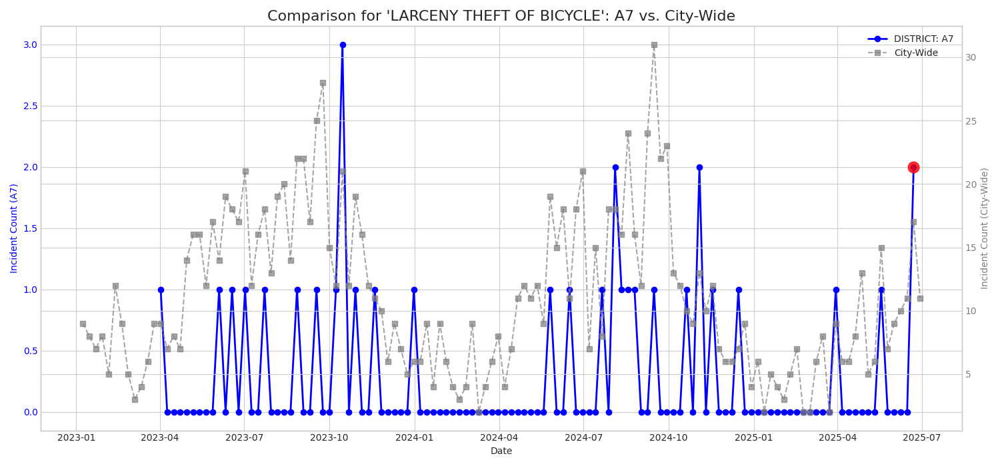

#### Finding 90: Anomaly in 'TOWED MOTOR VEHICLE' for B3
- **Date**: 2025-06-15
- **Observed Count**: 11 (Historical Avg: 5.09)
- **Magnitude (Z-Score)**: 2.22
- **Significance (p-value)**: 0.03499
- **City-Wide Context**: The same week was **not significant** for 'TOWED MOTOR VEHICLE' across all DISTRICTs (p-value: 0.2239).

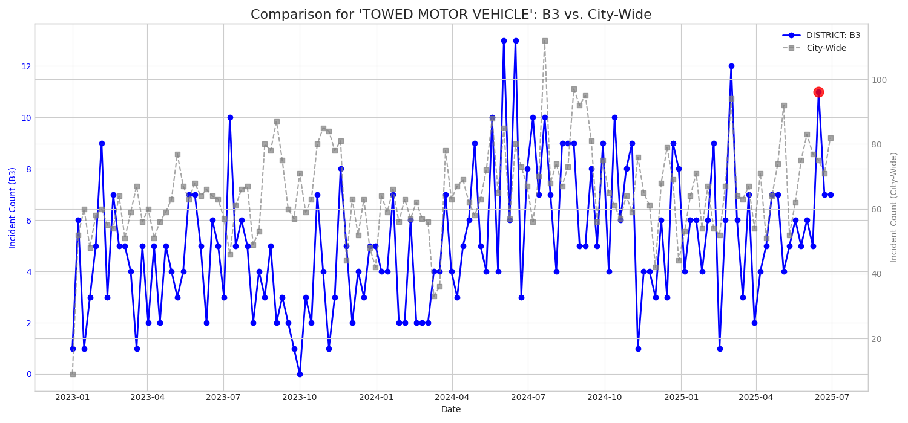

#### Finding 91: Trend in 'INVESTIGATE PROPERTY' for A7
- **Description**: Significant Downward Trend
- **Weekly Change (Slope)**: -2.20
- **Significance (p-value)**: 0.03524
- **City-Wide Context**: The trend for 'INVESTIGATE PROPERTY' across all DISTRICTs is: **Not Significant** (p-value: 0.9234, slope: 0.30).

#### Finding 92: Anomaly in 'BURGLARY - COMMERICAL' for B3
- **Date**: 2025-06-29
- **Observed Count**: 2 (Historical Avg: 0.26)
- **Magnitude (Z-Score)**: 3.25
- **Significance (p-value)**: 0.03571
- **City-Wide Context**: The same week was **significant** for 'BURGLARY - COMMERICAL' across all DISTRICTs (p-value: 0.02876).

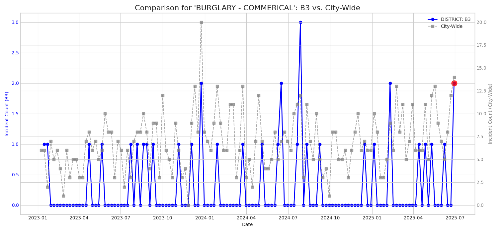

#### Finding 93: Anomaly in 'PROPERTY - LOST/ MISSING' for C6
- **Date**: 2025-06-29
- **Observed Count**: 7 (Historical Avg: 2.88)
- **Magnitude (Z-Score)**: 2.27
- **Significance (p-value)**: 0.03729
- **City-Wide Context**: The same week was **not significant** for 'PROPERTY - LOST/ MISSING' across all DISTRICTs (p-value: 0.3906).

#### Finding 94: Anomaly in 'M/V ACCIDENT - INVOLVING BICYCLE - INJURY' for D14
- **Date**: 2025-06-29
- **Observed Count**: 3 (Historical Avg: 0.59)
- **Magnitude (Z-Score)**: 2.80
- **Significance (p-value)**: 0.03754
- **City-Wide Context**: The same week was **not significant** for 'M/V ACCIDENT - INVOLVING BICYCLE - INJURY' across all DISTRICTs (p-value: 0.06122).

#### Finding 95: Anomaly in 'M/V ACCIDENT - OTHER' for B3
- **Date**: 2025-06-15
- **Observed Count**: 6 (Historical Avg: 2.28)
- **Magnitude (Z-Score)**: 2.32
- **Significance (p-value)**: 0.038
- **City-Wide Context**: The same week was **not significant** for 'M/V ACCIDENT - OTHER' across all DISTRICTs (p-value: 0.7511).

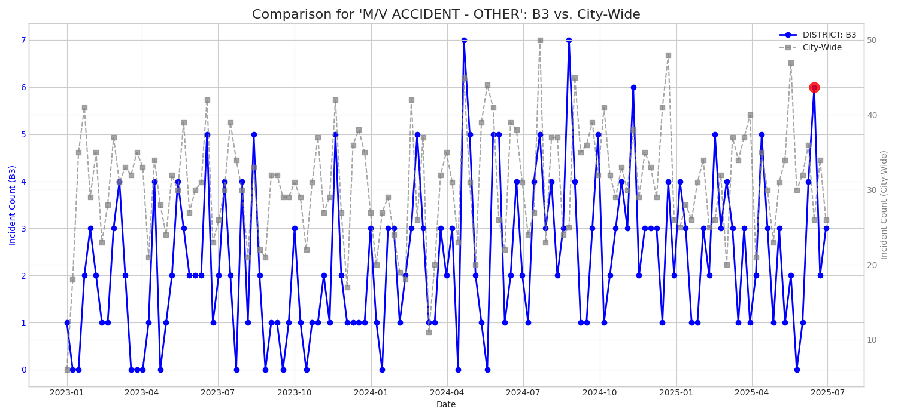

#### Finding 96: Anomaly in 'AUTO THEFT - MOTORCYCLE / SCOOTER' for C11
- **Date**: 2025-06-15
- **Observed Count**: 5 (Historical Avg: 0.92)
- **Magnitude (Z-Score)**: 2.63
- **Significance (p-value)**: 0.03872
- **City-Wide Context**: The same week was **not significant** for 'AUTO THEFT - MOTORCYCLE / SCOOTER' across all DISTRICTs (p-value: 0.1314).

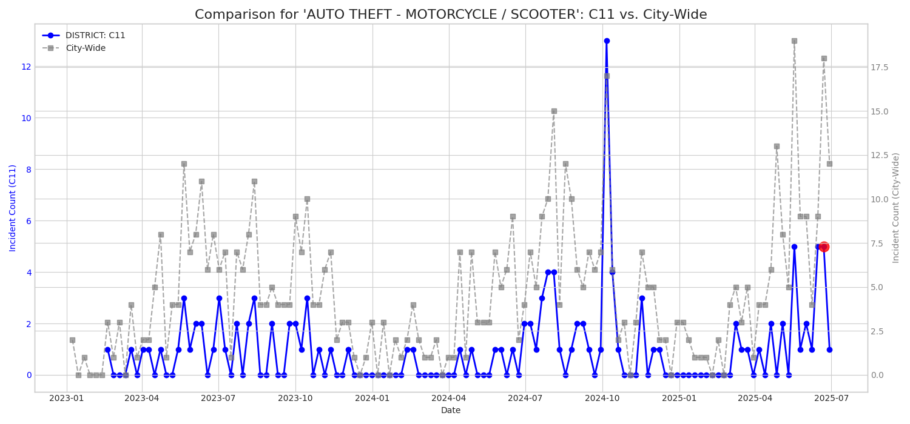

#### Finding 97: Anomaly in 'AUTO THEFT - MOTORCYCLE / SCOOTER' for C11
- **Date**: 2025-06-22
- **Observed Count**: 5 (Historical Avg: 0.92)
- **Magnitude (Z-Score)**: 2.63
- **Significance (p-value)**: 0.03872
- **City-Wide Context**: The same week was **significant** for 'AUTO THEFT - MOTORCYCLE / SCOOTER' across all DISTRICTs (p-value: 0.006913).

#### Finding 98: Anomaly in 'MISSING PERSON' for B2
- **Date**: 2025-06-29
- **Observed Count**: 2 (Historical Avg: 0.23)
- **Magnitude (Z-Score)**: 3.17
- **Significance (p-value)**: 0.03928
- **City-Wide Context**: The same week was **not significant** for 'MISSING PERSON' across all DISTRICTs (p-value: 0.0697).

#### Finding 99: Anomaly in 'LARCENY THEFT FROM BUILDING' for A15
- **Date**: 2025-06-08
- **Observed Count**: 3 (Historical Avg: 0.62)
- **Magnitude (Z-Score)**: 2.72
- **Significance (p-value)**: 0.03981
- **City-Wide Context**: The same week was **not significant** for 'LARCENY THEFT FROM BUILDING' across all DISTRICTs (p-value: 0.184).

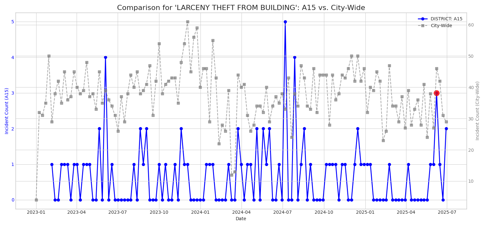

#### Finding 100: Anomaly in 'DEATH INVESTIGATION' for E5
- **Date**: 2025-06-08
- **Observed Count**: 2 (Historical Avg: 0.26)
- **Magnitude (Z-Score)**: 3.12
- **Significance (p-value)**: 0.03986
- **City-Wide Context**: The same week was **significant** for 'DEATH INVESTIGATION' across all DISTRICTs (p-value: 0.0297).

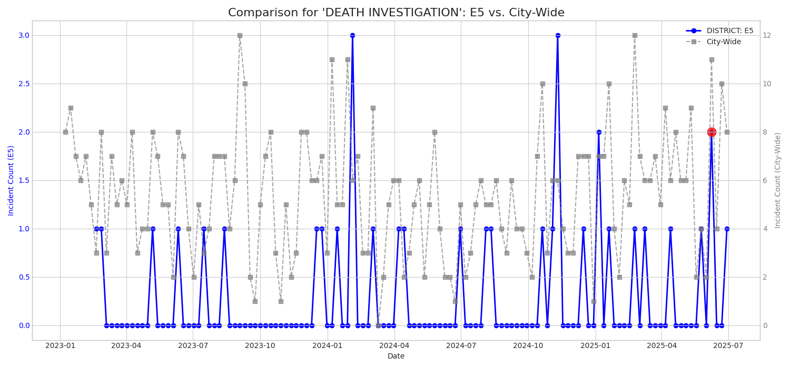

#### Finding 101: Anomaly in 'MISSING PERSON - LOCATED' for A1
- **Date**: 2025-06-22
- **Observed Count**: 3 (Historical Avg: 0.75)
- **Magnitude (Z-Score)**: 2.61
- **Significance (p-value)**: 0.03998
- **City-Wide Context**: The same week was **not significant** for 'MISSING PERSON - LOCATED' across all DISTRICTs (p-value: 0.9076).

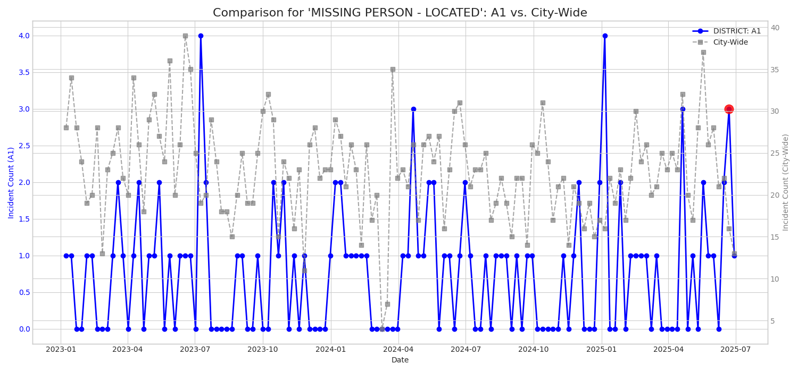

#### Finding 102: Anomaly in 'SEARCH WARRANT' for B2
- **Date**: 2025-06-15
- **Observed Count**: 3 (Historical Avg: 0.50)
- **Magnitude (Z-Score)**: 2.80
- **Significance (p-value)**: 0.04017
- **City-Wide Context**: The same week was **not significant** for 'SEARCH WARRANT' across all DISTRICTs (p-value: 0.1946).

#### Finding 103: Anomaly in 'WARRANT ARREST - OUTSIDE OF BOSTON WARRANT' for E13
- **Date**: 2025-06-15
- **Observed Count**: 2 (Historical Avg: 0.32)
- **Magnitude (Z-Score)**: 2.99
- **Significance (p-value)**: 0.04081
- **City-Wide Context**: The same week was **not significant** for 'WARRANT ARREST - OUTSIDE OF BOSTON WARRANT' across all DISTRICTs (p-value: 0.06252).

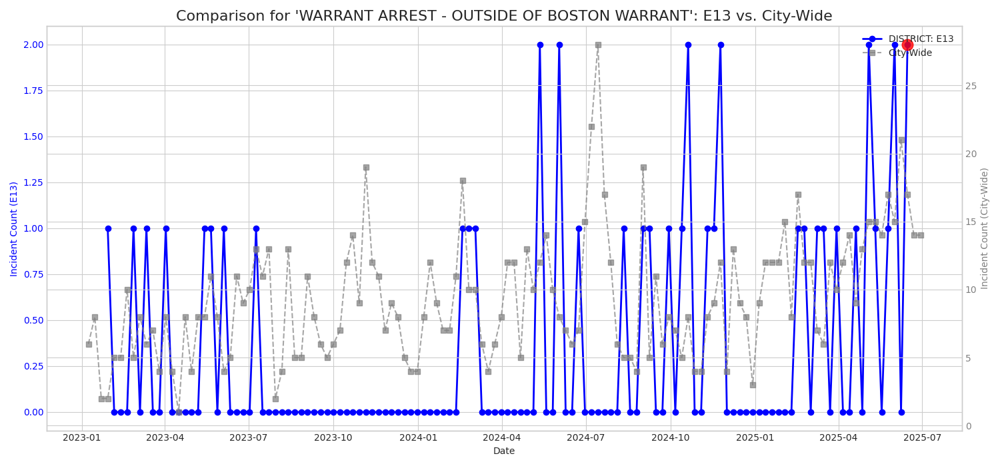

#### Finding 104: Anomaly in 'INVESTIGATE PROPERTY' for D4
- **Date**: 2025-06-29
- **Observed Count**: 15 (Historical Avg: 7.83)
- **Magnitude (Z-Score)**: 2.06
- **Significance (p-value)**: 0.04145
- **City-Wide Context**: The same week was **not significant** for 'INVESTIGATE PROPERTY' across all DISTRICTs (p-value: 0.3374).

#### Finding 105: Anomaly in 'BURGLARY - COMMERICAL' for E13
- **Date**: 2025-06-22
- **Observed Count**: 2 (Historical Avg: 0.29)
- **Magnitude (Z-Score)**: 3.01
- **Significance (p-value)**: 0.04194
- **City-Wide Context**: The same week was **not significant** for 'BURGLARY - COMMERICAL' across all DISTRICTs (p-value: 0.07804).

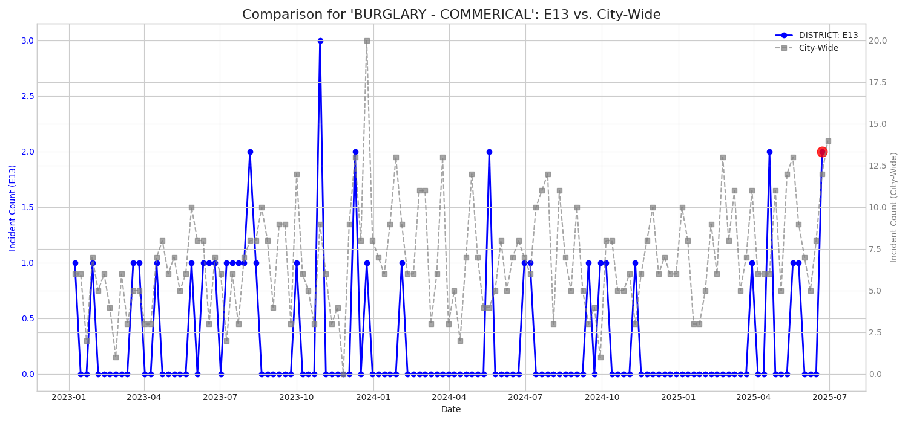

#### Finding 106: Anomaly in 'FRAUD - CREDIT CARD / ATM FRAUD' for B2
- **Date**: 2025-06-22
- **Observed Count**: 4 (Historical Avg: 1.19)
- **Magnitude (Z-Score)**: 2.43
- **Significance (p-value)**: 0.04211
- **City-Wide Context**: The same week was **not significant** for 'FRAUD - CREDIT CARD / ATM FRAUD' across all DISTRICTs (p-value: 0.505).

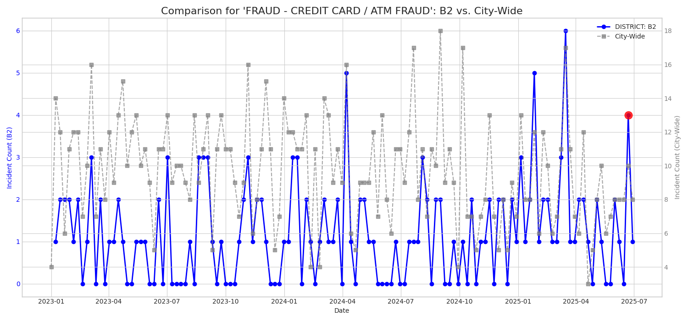

#### Finding 107: Anomaly in 'M/V - LEAVING SCENE - PROPERTY DAMAGE' for E13
- **Date**: 2025-06-29
- **Observed Count**: 10 (Historical Avg: 5.00)
- **Magnitude (Z-Score)**: 2.08
- **Significance (p-value)**: 0.04265
- **City-Wide Context**: The same week was **not significant** for 'M/V - LEAVING SCENE - PROPERTY DAMAGE' across all DISTRICTs (p-value: 0.5299).

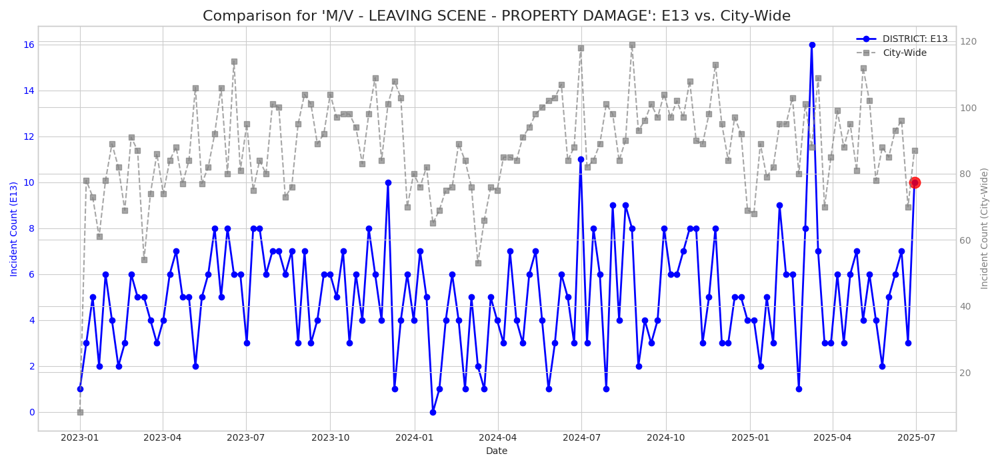

#### Finding 108: Anomaly in 'INVESTIGATE PROPERTY' for B3
- **Date**: 2025-06-29
- **Observed Count**: 13 (Historical Avg: 7.50)
- **Magnitude (Z-Score)**: 2.01
- **Significance (p-value)**: 0.04267
- **City-Wide Context**: The same week was **not significant** for 'INVESTIGATE PROPERTY' across all DISTRICTs (p-value: 0.3374).

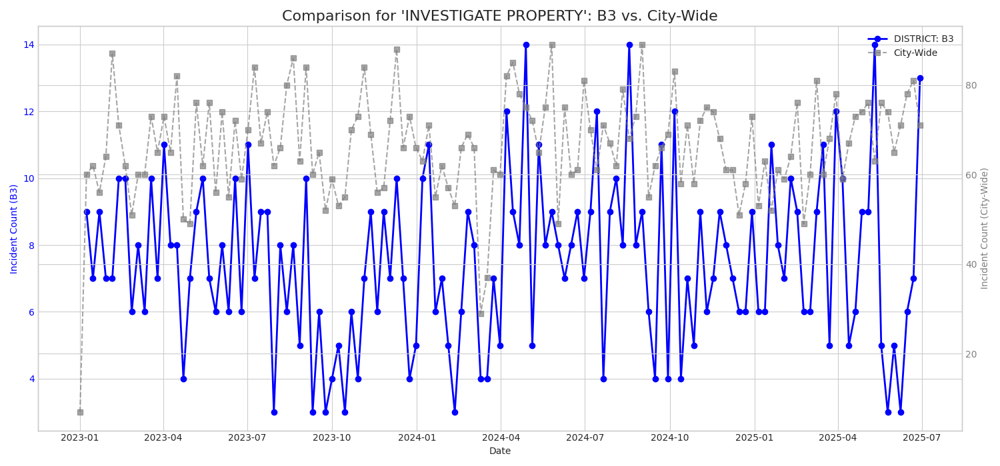

#### Finding 109: Anomaly in 'AUTO THEFT' for B3
- **Date**: 2025-06-22
- **Observed Count**: 5 (Historical Avg: 1.71)
- **Magnitude (Z-Score)**: 2.32
- **Significance (p-value)**: 0.04277
- **City-Wide Context**: The same week was **not significant** for 'AUTO THEFT' across all DISTRICTs (p-value: 0.6504).

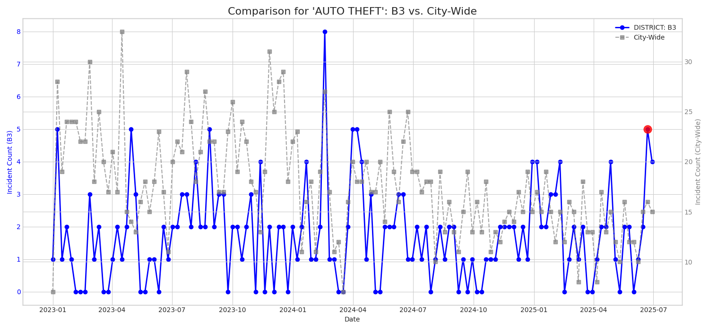

#### Finding 110: Anomaly in 'M/V - LEAVING SCENE - PROPERTY DAMAGE' for C6
- **Date**: 2025-06-15
- **Observed Count**: 14 (Historical Avg: 7.58)
- **Magnitude (Z-Score)**: 2.02
- **Significance (p-value)**: 0.04313
- **City-Wide Context**: The same week was **not significant** for 'M/V - LEAVING SCENE - PROPERTY DAMAGE' across all DISTRICTs (p-value: 0.3002).

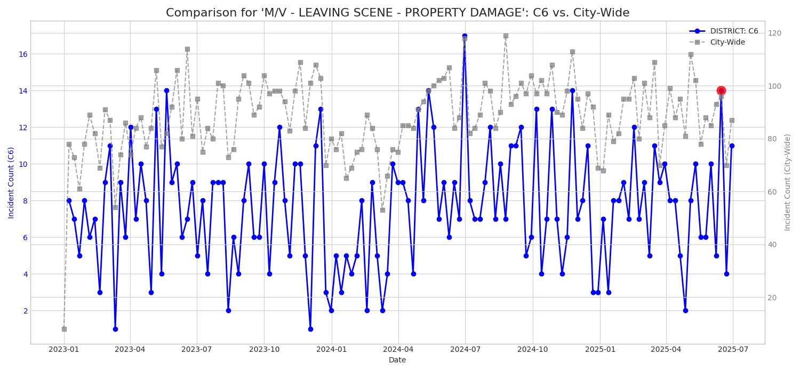

#### Finding 111: Anomaly in 'AUTO THEFT - MOTORCYCLE / SCOOTER' for B2
- **Date**: 2025-06-08
- **Observed Count**: 3 (Historical Avg: 0.64)
- **Magnitude (Z-Score)**: 2.61
- **Significance (p-value)**: 0.04416
- **City-Wide Context**: The same week was **not significant** for 'AUTO THEFT - MOTORCYCLE / SCOOTER' across all DISTRICTs (p-value: 0.5184).

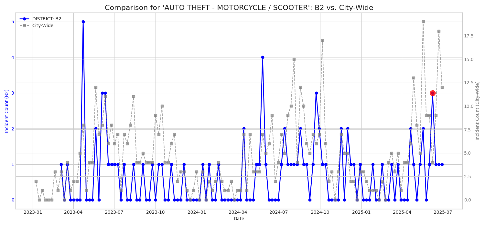

#### Finding 112: Anomaly in 'VAL - VIOLATION OF AUTO LAW' for D14
- **Date**: 2025-06-15
- **Observed Count**: 4 (Historical Avg: 0.95)
- **Magnitude (Z-Score)**: 2.49
- **Significance (p-value)**: 0.04423
- **City-Wide Context**: The same week was **not significant** for 'VAL - VIOLATION OF AUTO LAW' across all DISTRICTs (p-value: 0.2612).

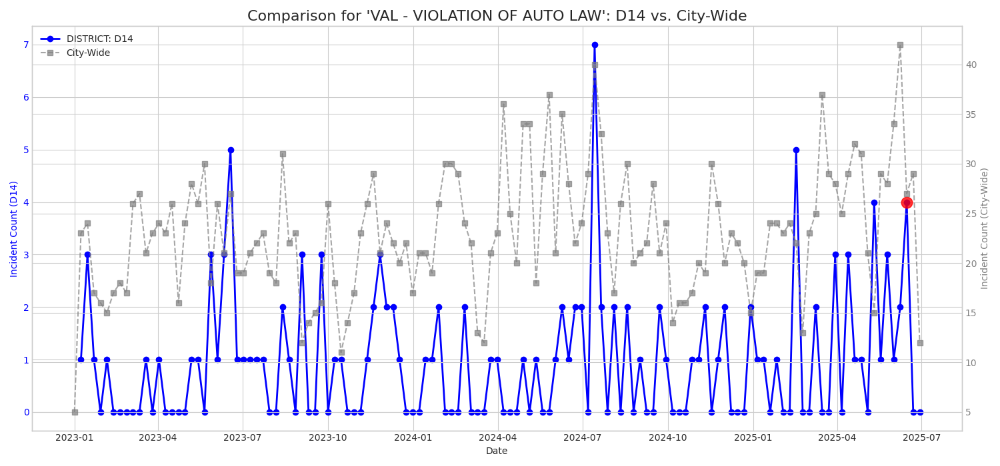

#### Finding 113: Anomaly in 'WARRANT ARREST - OUTSIDE OF BOSTON WARRANT' for B3
- **Date**: 2025-06-08
- **Observed Count**: 4 (Historical Avg: 1.04)
- **Magnitude (Z-Score)**: 2.44
- **Significance (p-value)**: 0.0451
- **City-Wide Context**: The same week was **significant** for 'WARRANT ARREST - OUTSIDE OF BOSTON WARRANT' across all DISTRICTs (p-value: 0.01564).

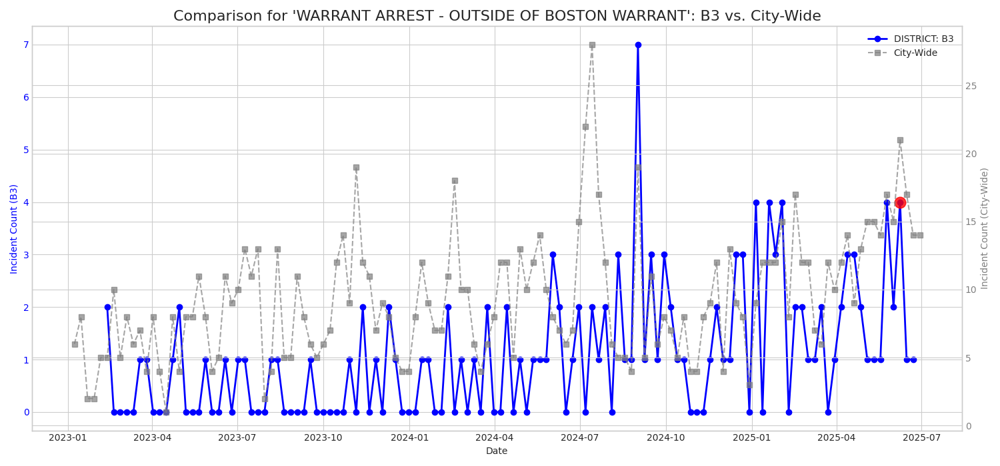

#### Finding 114: Anomaly in 'BALLISTICS EVIDENCE/FOUND' for B2
- **Date**: 2025-06-29
- **Observed Count**: 3 (Historical Avg: 0.78)
- **Magnitude (Z-Score)**: 2.50
- **Significance (p-value)**: 0.04515
- **City-Wide Context**: The same week was **not significant** for 'BALLISTICS EVIDENCE/FOUND' across all DISTRICTs (p-value: 0.06313).

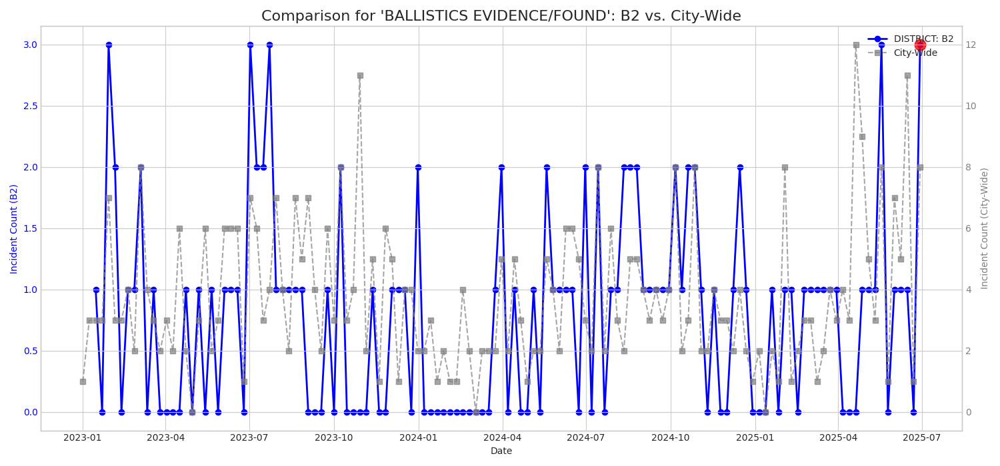

#### Finding 115: Trend in 'INVESTIGATE PROPERTY' for B3
- **Description**: Significant Upward Trend
- **Weekly Change (Slope)**: 3.10
- **Significance (p-value)**: 0.04559
- **City-Wide Context**: The trend for 'INVESTIGATE PROPERTY' across all DISTRICTs is: **Not Significant** (p-value: 0.9234, slope: 0.30).

#### Finding 116: Anomaly in 'ASSAULT - AGGRAVATED' for E13
- **Date**: 2025-06-22
- **Observed Count**: 4 (Historical Avg: 1.33)
- **Magnitude (Z-Score)**: 2.32
- **Significance (p-value)**: 0.04594
- **City-Wide Context**: The same week was **not significant** for 'ASSAULT - AGGRAVATED' across all DISTRICTs (p-value: 0.2409).

#### Finding 117: Anomaly in 'INVESTIGATE PERSON' for C6
- **Date**: 2025-06-08
- **Observed Count**: 18 (Historical Avg: 10.55)
- **Magnitude (Z-Score)**: 1.94
- **Significance (p-value)**: 0.04665
- **City-Wide Context**: The same week was **significant** for 'INVESTIGATE PERSON' across all DISTRICTs (p-value: 0.043).

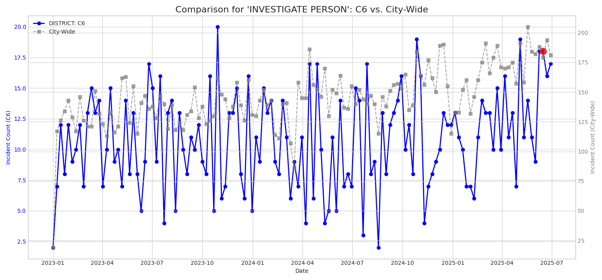

#### Finding 118: Anomaly in 'INVESTIGATE PERSON' for C6
- **Date**: 2025-06-15
- **Observed Count**: 18 (Historical Avg: 10.55)
- **Magnitude (Z-Score)**: 1.94
- **Significance (p-value)**: 0.04665
- **City-Wide Context**: The same week was **not significant** for 'INVESTIGATE PERSON' across all DISTRICTs (p-value: 0.08234).

#### Finding 119: Anomaly in 'BURGLARY - COMMERICAL' for A1
- **Date**: 2025-06-29
- **Observed Count**: 5 (Historical Avg: 1.64)
- **Magnitude (Z-Score)**: 2.27
- **Significance (p-value)**: 0.04684
- **City-Wide Context**: The same week was **significant** for 'BURGLARY - COMMERICAL' across all DISTRICTs (p-value: 0.02876).

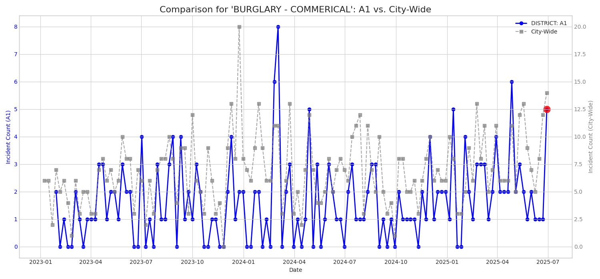

#### Finding 120: Anomaly in 'AUTO THEFT - MOTORCYCLE / SCOOTER' for B3
- **Date**: 2025-06-22
- **Observed Count**: 3 (Historical Avg: 0.58)
- **Magnitude (Z-Score)**: 2.59
- **Significance (p-value)**: 0.04696
- **City-Wide Context**: The same week was **significant** for 'AUTO THEFT - MOTORCYCLE / SCOOTER' across all DISTRICTs (p-value: 0.006913).

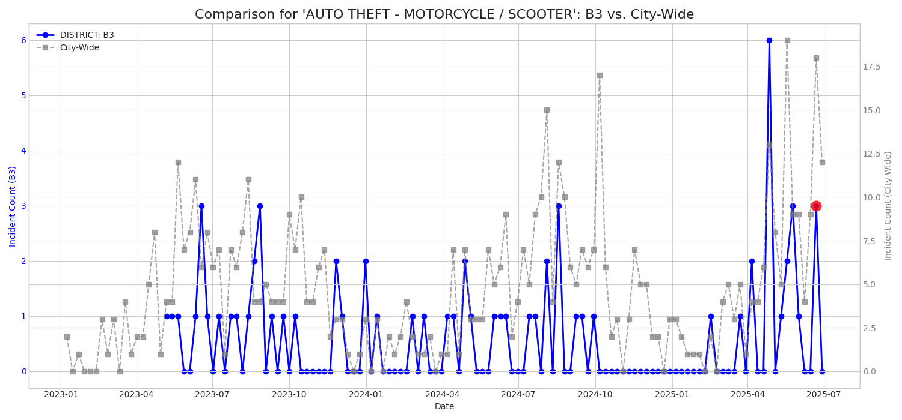

#### Finding 121: Anomaly in 'ANIMAL INCIDENTS (DOG BITES, LOST DOG, ETC)' for C6
- **Date**: 2025-06-15
- **Observed Count**: 2 (Historical Avg: 0.34)
- **Magnitude (Z-Score)**: 2.82
- **Significance (p-value)**: 0.0472
- **City-Wide Context**: The same week was **not significant** for 'ANIMAL INCIDENTS (DOG BITES, LOST DOG, ETC)' across all DISTRICTs (p-value: 0.5069).

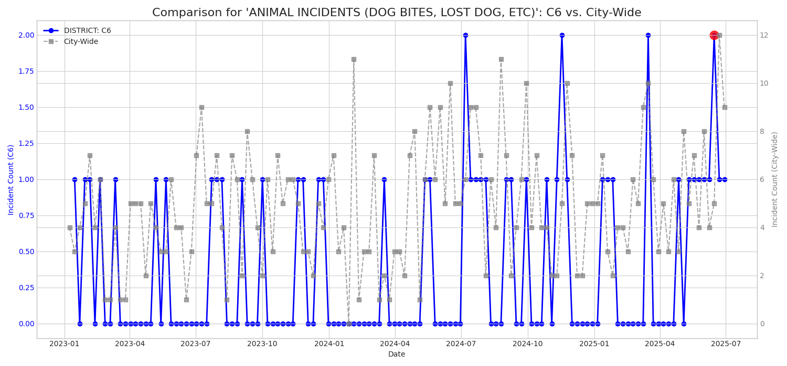

#### Finding 122: Anomaly in 'INVESTIGATE PERSON' for E5
- **Date**: 2025-06-08
- **Observed Count**: 15 (Historical Avg: 8.17)
- **Magnitude (Z-Score)**: 1.96
- **Significance (p-value)**: 0.04741
- **City-Wide Context**: The same week was **significant** for 'INVESTIGATE PERSON' across all DISTRICTs (p-value: 0.043).

---
## Appendix: Definition of Terms
- **Poisson Distribution**: A discrete probability distribution for the counts of events that occur randomly in a given interval of time or space.
- **Negative Binomial Distribution**: A generalization of the Poisson distribution that allows for overdispersion, where the variance is greater than the mean.
- **P-value**: The probability of obtaining test results at least as extreme as the results actually observed, under the assumption that the null hypothesis is correct.
- **Z-score**: A measure of how many standard deviations an observation or data point is from the mean of a distribution. It provides a standardized measure of an anomaly's magnitude.