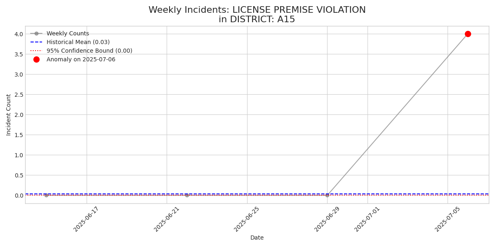
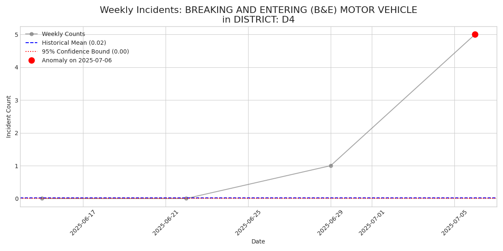
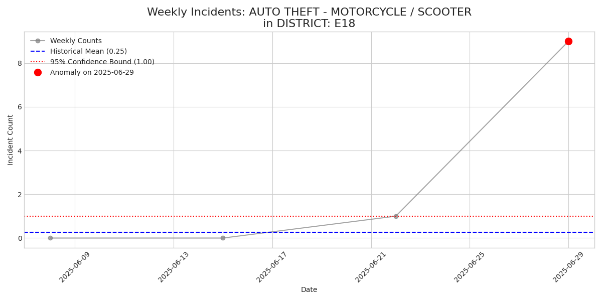

# Scholarly Report on Univariate Time Series Analysis
## Executive Summary
This report presents a statistical analysis of incident frequency over time, aimed at identifying significant deviations from historical norms (anomalies) and detecting emerging patterns (trends). The dataset was disaggregated into distinct time series based on the categorical variables `DISTRICT` and `OFFENSE_DESCRIPTION`. Each resulting time series, representing weekly incident counts, was modeled using an appropriate discrete probability distribution (Poisson or Negative Binomial) selected based on the data's empirical properties. The last four weeks of data were evaluated against these models to quantify anomalous activity. Concurrently, a linear regression analysis was performed on these recent data points to assess the direction and statistical significance of any short-term trends. To mitigate the risk of false positives inherent in multiple testing, a Bonferroni correction was applied, yielding a highly conservative threshold for statistical significance. The findings detailed herein pinpoint specific incident categories that exhibit unusual behavior, providing a robust empirical basis for further investigation.
---
## 1. Methodology
The analytical approach comprises several sequential steps: data preparation, model selection, anomaly scoring, trend detection, and statistical correction.

### 1.1. Data Preparation and Aggregation
The raw incident data was first partitioned into subgroups based on unique combinations of the `DISTRICT` and `OFFENSE_DESCRIPTION` fields. For each subgroup, a time series was constructed by resampling the data into weekly incident counts. A minimum of eight weeks of data was required for a subgroup to be included in the analysis, ensuring a stable baseline for historical modeling.

### 1.2. Probabilistic Model Selection
For each time series, a choice was made between two fundamental discrete probability distributions to model the historical weekly counts:
1.  **Poisson Distribution**: Assumes the mean and variance of the counts are equal. It is suitable for events that occur at a constant average rate independently of the time since the last event.
2.  **Negative Binomial (NB) Distribution**: A more flexible alternative that allows the variance to be greater than the mean, a property known as **overdispersion**.
The model selection was based on an empirical test: if the variance of the historical weekly counts was greater than the mean, the Negative Binomial distribution was chosen. Otherwise, the more parsimonious Poisson model was used.

### 1.3. Anomaly and Trend Detection
Anomalies were identified by calculating an **anomaly p-value** for each of the last four weeks against the fitted historical model. To quantify the magnitude of each anomaly, a **z-score** was also computed. Trends were assessed by fitting a simple linear regression model to the last four weeks of data, yielding a **trend p-value**.

### 1.4. Correction for Multiple Comparisons
A large number of statistical tests were performed across all subgroups, increasing the probability of Type I errors (false positives). To counteract this, the **Bonferroni correction** was applied. This method adjusts the significance threshold by dividing the conventional alpha level (α = 0.05) by the total number of tests performed.
The adjusted significance threshold for this analysis is **p < 8.389e-06**. Only findings that meet this stricter criterion are reported as statistically significant.

---
## 2. Analysis by Group

### 2.1 Analysis for DISTRICT: A1

#### Significant Trends
| OFFENSE_DESCRIPTION | Trend Description | Weekly Change (Slope) | P-Value |
|---|---|---|---|
| VANDALISM | Significant Downward Trend | -1.00 | 1e-20 |

### 2.1 Analysis for DISTRICT: A15

#### Significant Anomalies
| Week | OFFENSE_DESCRIPTION | Observed Count | Z-Score | P-Value | Visualization |
|---|---|---|---|---|---|
| 2025-07-06 | LICENSE PREMISE VIOLATION | 4 | 21.73 | 5.009e-08 |  |

### 2.1 Analysis for DISTRICT: A7

No statistically significant trends or anomalies were detected for this group after applying the Bonferroni correction.

### 2.1 Analysis for DISTRICT: B2

No statistically significant trends or anomalies were detected for this group after applying the Bonferroni correction.

### 2.1 Analysis for DISTRICT: B3

No statistically significant trends or anomalies were detected for this group after applying the Bonferroni correction.

### 2.1 Analysis for DISTRICT: C11

No statistically significant trends or anomalies were detected for this group after applying the Bonferroni correction.

### 2.1 Analysis for DISTRICT: C6

No statistically significant trends or anomalies were detected for this group after applying the Bonferroni correction.

### 2.1 Analysis for DISTRICT: D14

No statistically significant trends or anomalies were detected for this group after applying the Bonferroni correction.

### 2.1 Analysis for DISTRICT: D4

#### Significant Anomalies
| Week | OFFENSE_DESCRIPTION | Observed Count | Z-Score | P-Value | Visualization |
|---|---|---|---|---|---|
| 2025-07-06 | BREAKING AND ENTERING (B&E) MOTOR VEHICLE | 5 | 37.62 | 1.365e-11 |  |

### 2.1 Analysis for DISTRICT: E13

No statistically significant trends or anomalies were detected for this group after applying the Bonferroni correction.

### 2.1 Analysis for DISTRICT: E18

#### Significant Anomalies
| Week | OFFENSE_DESCRIPTION | Observed Count | Z-Score | P-Value | Visualization |
|---|---|---|---|---|---|
| 2025-06-29 | AUTO THEFT - MOTORCYCLE / SCOOTER | 9 | 14.53 | 5.758e-06 |  |

### 2.1 Analysis for DISTRICT: E5

No statistically significant trends or anomalies were detected for this group after applying the Bonferroni correction.

### 2.1 Analysis for DISTRICT: External

No statistically significant trends or anomalies were detected for this group after applying the Bonferroni correction.

---
## Appendix: Definition of Terms
- **Poisson Distribution**: A discrete probability distribution for the counts of events that occur randomly in a given interval of time or space.
- **Negative Binomial Distribution**: A generalization of the Poisson distribution that allows for overdispersion, where the variance is greater than the mean.
- **Overdispersion**: The presence of greater variability (statistical dispersion) in a dataset than would be expected based on a given statistical model.
- **P-value**: The probability of obtaining test results at least as extreme as the results actually observed, under the assumption that the null hypothesis is correct. A smaller p-value indicates stronger evidence against the null hypothesis.
- **Z-score**: A measure of how many standard deviations an observation or data point is from the mean of a distribution. It provides a standardized measure of an anomaly's magnitude.
- **Bonferroni Correction**: A method used to counteract the multiple comparisons problem by adjusting the p-value threshold for significance. It is calculated as α/n, where α is the desired alpha level (e.g., 0.05) and n is the number of tests.